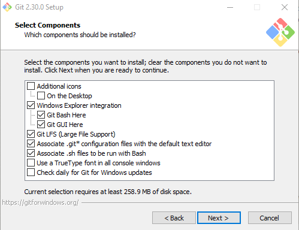
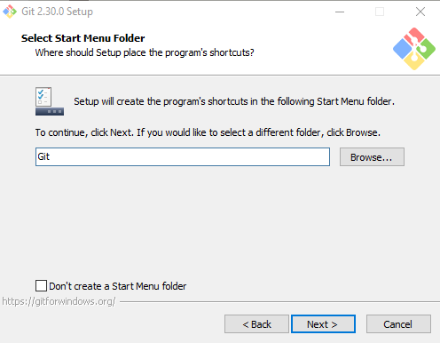
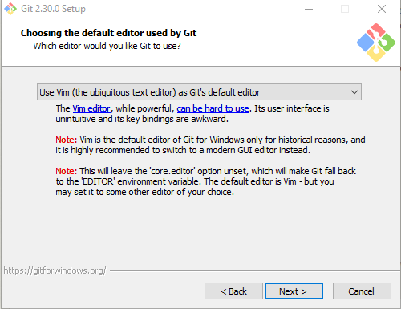
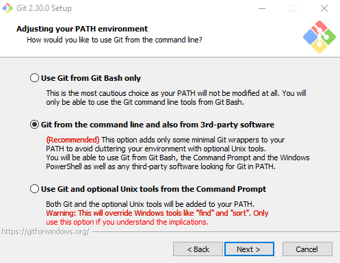
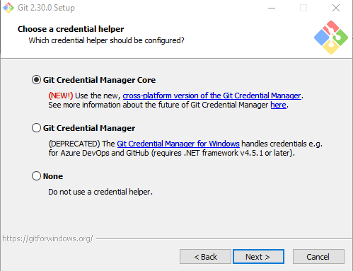
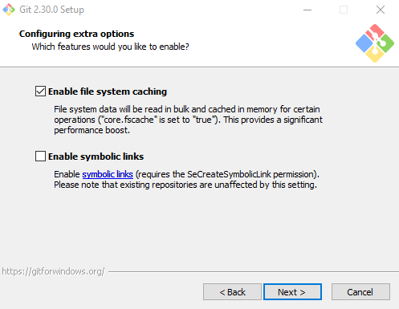
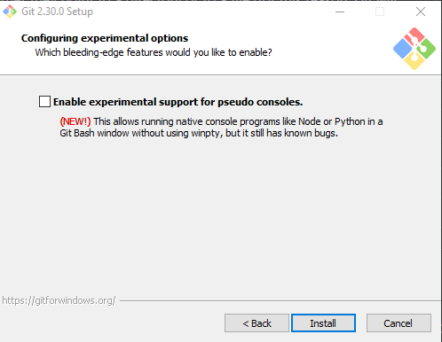

```{r setup, include=FALSE}
knitr::opts_chunk$set(echo = TRUE)
```

<br>

Here are some tips for installing Git in Windows. You can find the most recent version of the software [here](https://git-scm.com/download/win). The following screenshots show the options I recommend selecting during the installation process.

<div class="boxy boxy-blue boxy-clipboard-list">
**Task:** After agreeing to the terms of service, click **Next**.
</div>


<div class="boxy boxy-blue boxy-clipboard-list">
**Task:** Select the components to be installed.
</div>

<br>



<br>

<div class="boxy boxy-blue boxy-clipboard-list">
**Task:** Select the start menu folder.
</div>

<br>



<br>

<div class="boxy boxy-blue boxy-clipboard-list">
**Task:** Choose the default editor to be used by Git.
</div>

<br>




<br>

<div class="boxy boxy-blue boxy-clipboard-list">
**Task:** Select the name of the initial branch in new repositories.
</div>

<br>


<br>

<div class="boxy boxy-blue boxy-clipboard-list">
**Task:** Select how you would like to use Git from the command line.
</div>

<br>




<br>

<div class="boxy boxy-blue boxy-clipboard-list">
**Task:** Select the SSL/TLS library that you want Git to use.
</div>

<br>


<br>

<div class="boxy boxy-blue boxy-clipboard-list">
**Task:** Select the terminal editor to use with Git Bash.
</div>

<br>


<br>

<div class="boxy boxy-blue boxy-clipboard-list">
**Task:** Choose the default behavior of `git pull`.
</div>

<br>


<br>

<div class="boxy boxy-blue boxy-clipboard-list">
**Task:** Choose the credential helper.
</div>

<br>



<br>

<div class="boxy boxy-blue boxy-clipboard-list">
**Task:** Configure the extra options.
</div>

<br>



<br>

<div class="boxy boxy-blue boxy-clipboard-list">
**Task:** Configure the experimental options.
</div>

<br>



<br>


