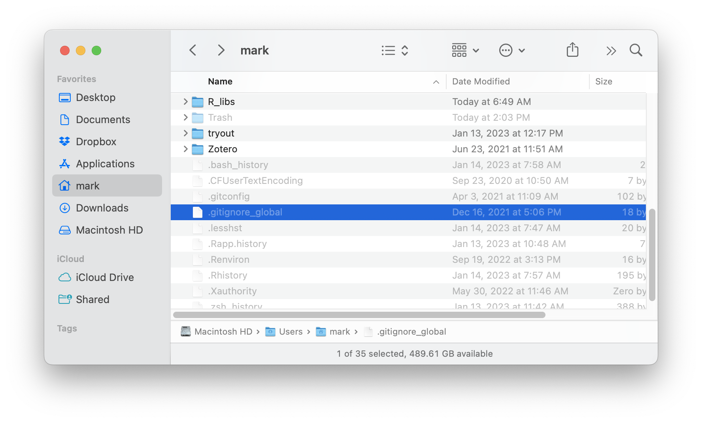
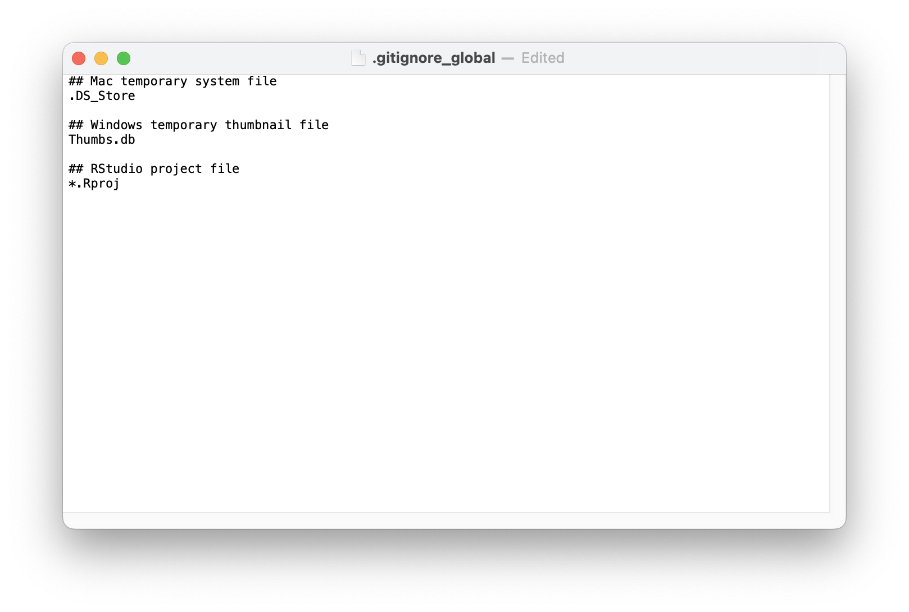

```{r setup, include=FALSE}
knitr::opts_chunk$set(echo = TRUE)
```

<br>

# What is a `.gitignore` file?

As its name might suggest, a `.gitignore` file specifies folders or files that Git should intentionally ignore (i.e., leave "untracked"). Each line in the `.gitignore` files specifies a folder, filename, or patterns to be matched against folders or filenames. Here are some of things to note about characters and patterns in `.gitignore` file (you can find more details [here](https://git-scm.com/docs/gitignore)).

* Any line or string beginning with `#` is considered a comment. If you want to match a literal `#`, precede it with a backslash (i.e., `\#`).

* A blank line won't match anything, so you can use it to separate other lines or blocks of code and improve readability.

* Trailing spaces are ignored unless they are preceded by a backslash (e.g., `\  `).

* Use a forward slash (`/`) to separate directories.

    - A `/` may occur at the beginning, middle or end of the `.gitignore` search pattern.

    - If there is a `/` at the beginning or middle (or both) of the pattern, then the pattern is relative to the folder/directory level of the particular `.gitignore` file itself.

    - If there is a `/` at the end of the pattern, the pattern will only match folders/directories, otherwise the pattern can match both files and folders/directories
    
    - All paths are relative to the location of the `.gitignore` file (e.g., `data/science/` matches the `data/science` directory, but not the `x/data/science` directory_.

* An asterisk `*` is a wild card that matches anything except a forward slash (`/`) (e.g., `data/*` would ignore everything in the data folder). The question mark `?` matches any _single_ character except a forward slash `/`.

***

# Why use a `.gitignore` file?

There are several reasons you might use a `.gitignore` file. At a philosophical level, your workflow should really include only the files and accompanying instructions or code necessary to reproduce the specific analysis. For example, operating systems may leave esoteric files behind that don't have any influence on the inputs or outputs of the analysis, nor would they matter to a different OS (see below). At a more practical level, you might not need to track the `.html` files generated by a `.Rmd` file if they were not part of a rendered website. Or, you might have very large data files that are updated and shared with your team members via different means.

***

# Using a `.gitignore` file

When you place a folder/directory under version control via Git (e.g., `git init`), Git does not automatically create a `.gitignore` file, so you have to do so manually. In general, the exclusions you include in any `.gitignore` file should be specific to the project and its associated folders/directories and files. When you create a new repo in GitHub, you have the option of creating a `.gitignore` file based upon a variety of templates for common project or coding types (e.g., R, Python).

***

# Global `.gitignore` file

There may be some files or file types that you would _never_ want to track via Git. Fortunately, Git allows you to specify a global `.gitignore` file, such that any exclusions listed in it will apply to _any_ folder/directory under Git's version control.

### Locating your global `.gitignore`

<div class="boxy boxy-orange boxy-lightbulb">
**Tip:** You can check if you have a global `.gitignore` file, and where it's located, by typing the following command in the **Terminal**.
</div>

```sh
git config --get core.excludesfile
```

The default location for the global file is typically one of the following (where `[user-name]` is your user name on your computer).

**Mac or Linux**

```sh
/Users/[user-name]/.config/git/ignore
```

**Windows**

```sh
C:\Users\[user-name]\.config\git\ignore
```

<div class="boxy boxy-red boxy-exclamation">
**Note:** If the above command returns a different path/file, make note of the location, as you will need to edit it below.
</div>

### Defining your global `.gitignore`

If you don't have a global `.gitignore` file defined, or if you'd like to change it, you can use the following code to do so.

<div class="boxy boxy-blue boxy-clipboard-list">
**Task:** Open RStudio and switch to the **Terminal** window.
</div>

<div class="boxy boxy-blue boxy-clipboard-list">
**Task:** Switch folders/directories to the user's root folder/directory.
</div>

<div class="boxy boxy-red boxy-exclamation">
**Note:** Here we are going to place the global ignore file in the user's root directory, which is designated by `~` (i.e., `/Users/[user-name]/` or `C:\Users\[user-name]\`).
</div>

```sh
$ cd ~
```

<div class="boxy boxy-blue boxy-clipboard-list">
**Task:** Create a new global ignore file called `.gitignore_global`
</div>

```sh
$ touch .gitignore_global
```

<div class="boxy boxy-blue boxy-clipboard-list">
**Task:** Tell Git where to find the global ignore file.
</div>

```sh
$ git config --global core.excludesfile ~/.gitignore_global
```

<div class="boxy boxy-blue boxy-clipboard-list">
**Task:** Navigate to your newly created `.gitignore_global` and open (double-click) it.
</div>

<div class="boxy boxy-orange boxy-lightbulb">
**Tip:** Files beginning with a period `.` are generally hidden from view. <br>

&nbsp; To see hidden files on a Mac, press `shift + command + .`. <br>

&nbsp; On Windows, do the following:
<ol>
  <li>Open **File Explorer**.</li>
  <li>Select _View_ > _Options_ > _Change folder and search options_.</li>
  <li>Select the **View** tab and, in **Advanced settings**, select _Show hidden files, folders, and drives_.</li>
  <li>Click **OK**.</li>
</ol>
</div>



<div class="boxy boxy-blue boxy-clipboard-list">
**Task:** Add the following lines to `.gitignore_global` and save it.
</div>

```sh
## Mac temporary file
.DS_Store

## Windows temporary thumbnail file
Thumbs.db

## Studio project file
*.Rproj
```



<div class="boxy boxy-success boxy-check">
**Success:** You now have a global excludes file for ignoring files you don't want Git to track.
</div>


