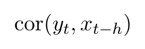
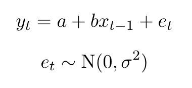

```{r setup, include=FALSE}
knitr::opts_chunk$set(echo = TRUE)
```

<br>

# Background

This past week you saw various ways to format `.pdf` documents using **R Markdown** and some simple **LaTeX** commands. Your assignment is to create a `report` based upon the template [here](hw_06_template.Rmd) that includes all of the attributes below. When you save and open the template, you will see that the `YAML` section is missing. You will have to add one and modify it accordingly to match the criteria below.

## Title page

* Title: "My Report for Assignment 6"  
* Author: your first and last names
* Date: dynamically assigned when knitted using a format of `month_name day, four_digit_year`

## Content

* All sections and text in the template document  
* Table of contents that includes the 3 levels of headings in the template document

## Layout

### General

* 1.5" margins on the top and bottom  
* 1" on the left and right side  
* 11-point type (the default font is OK)
* 1.5 line spacing

### Header & footer

* Your last name in the upper left of all pages  
* `Assignment 6` in the upper right of all pages
* the page number in the bottom center of all pages

**Note**: Because you're using a `report` format, the header and footer will not appear at the beginning of the doc or on the first page of a new section.

### Equations

You will need to insert 3 equations into the template document at the locations indicated by the blocks. When formatted, the equations should appear as follows (paying attention to text appearing as regular versus italic type):

#### Eqn 1 (single line)

  

#### Eqns 2 & 3 (two lines)

  

#### Eqn 4 (single line)

  

### References

You will need to insert 2 citations into the **Discussion** section at the locations indicated on the template, and create a list of automatically formatted references in the **References** section. You should use the style template for the journal *Ecology*.


# Submission

You should create a new **GitHub** repo called `Assignment-6` that includes both your `.Rmd` source file and the resulting `.pdf`. When you are finished,

1) invite Mark as a collaborator to your repo;

2) create a new issue that briefly describes what you've done; and 

3) tag Mark in the issue so he can check out your work.
