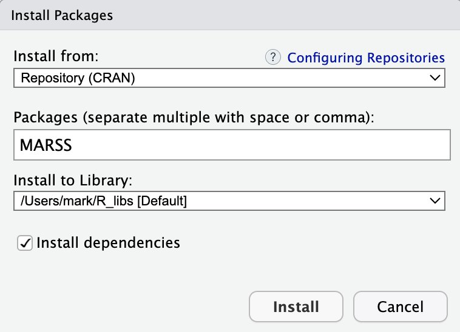

```{r dfa-setup, include=FALSE, purl=FALSE}
## in case you forget to add a chunk label
knitr::opts_knit$set(unnamed.chunk.label = "dfa-")
```

<br>

# Introduction

We've already seen several functions in the base installation of R that allow us to fit simple time series models and examine diagnostics. Moving forward, however, we'll need some additional packages and software. This tutorial will help you do so.

***

# {MARSS}

Our workhorse package for fitting univariate and multivariate time series models is {MARSS}, which stands for "Multivariate AutoRegressive State Space". You will see as the course progresses that many different kinds of models can be set up using the exact same mathematical framework, which will allow us to use the same software to fit them and estimate parameters of interest.

<br>

**Option 1**

<div class="boxy boxy-blue boxy-clipboard-list">
**Task:** Install the {MARSS} package using the R command line.
</div>

```{r install_MARSS, eval = FALSE}
install.packages("MARSS", dependencies = TRUE)
```

<br>

**Option 2**

<div class="boxy boxy-blue boxy-clipboard-list">
**Task:** Install the {MARSS} package using the dropdown menu in RStudio.
</div>

From the menu bar, navigate to **Tools > Install Packages...** and enter "MARSS" in the box for package name.

<div class="boxy boxy-red boxy-exclamation">
**Note:** You should check the box next to **Install dependencies**.
</div>

```{r, echo = FALSE, out.width = "50%", fig.align = "left"}

```

***

# TMB


