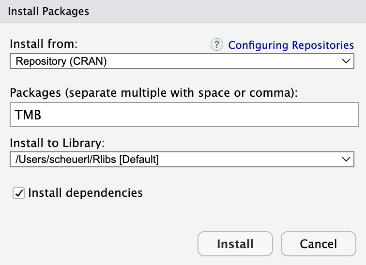

<br>

# Introduction

We've already seen several functions in the base installation of R that allow us to fit simple time series models and examine diagnostics. Moving forward, however, we'll need some additional packages and software. This tutorial will help you do so.

***

# {MARSS}

Our workhorse package for fitting univariate and multivariate time series models is {MARSS}, which stands for "**M**ultivariate **A**uto**R**egressive **S**tate **S**pace". You will see as the course progresses that many different kinds of models can be set up using the exact same mathematical framework, which will allow us to use the same software to fit them and estimate parameters of interest.

If you'd like to learn more about the {MARSS} package and the types of models you can fit with it, check out the [User Guide](https://cran.r-project.org/web/packages/MARSS/vignettes/UserGuide.pdf).

### Option 1

<div class="boxy boxy-blue boxy-clipboard-list">
**Task:** Install the {MARSS} package using the R command line.
</div>

```{r install_MARSS, eval = FALSE}
install.packages("MARSS", dependencies = TRUE)
```

### Option 2

<div class="boxy boxy-blue boxy-clipboard-list">
**Task:** Install the {MARSS} package using the dropdown menu in RStudio.
</div>

From the menu bar, navigate to **Tools > Install Packages...** and enter "MARSS" in the box for package name.

<div class="boxy boxy-red boxy-exclamation">
**Note:** You should check the box next to **Install dependencies**.
</div>

```{r, echo = FALSE, out.width = "60%", fig.align = "center"}
knitr::include_graphics("images/install_MARSS_RStudio.png")
```

***

# {TMB}

Template Model Builder (TMB) is a package that allows one to quickly implement complex random effect models through simple C++ templates. You won't have to use the package directly or write TMB code, but it's required to use the {marssTMB} package, which we'll use for fitting large models that are hard to fit.

### Option 1

<div class="boxy boxy-blue boxy-clipboard-list">
**Task:** Install the {TMB} package using the R command line.
</div>

```{r install_TMB, eval = FALSE}
install.packages("TMB", dependencies = TRUE)
```

### Option 2

<div class="boxy boxy-blue boxy-clipboard-list">
**Task:** Install the {TMB} package using the dropdown menu in RStudio.
</div>

From the menu bar, navigate to **Tools > Install Packages...** and enter "TMB" in the box for package name.

<div class="boxy boxy-red boxy-exclamation">
**Note:** You should check the box next to **Install dependencies**.
</div>

```{r, echo = FALSE, out.width = "60%", fig.align = "center"}

```


***

# {marssTMB}

The {MARSS} package mentioned above uses an expectation-maximization algorithm to fit models in a maximum likelihood framework. Although it's very robust, it can be rather slow for some large problems and data sets. The {marssTMB} package takes advantage of the C++ libraries and sparse matrix routines in TMB to fit models much faster.

<div class="boxy boxy-blue boxy-clipboard-list">
**Task:** Install the {marssTMB} package using the R command line.
</div>

```{r install_marssTMB, eval = FALSE}
install.packages('marssTMB',
                 repos = c('https://atsa-es.r-universe.dev','https://cloud.r-project.org'))
```


