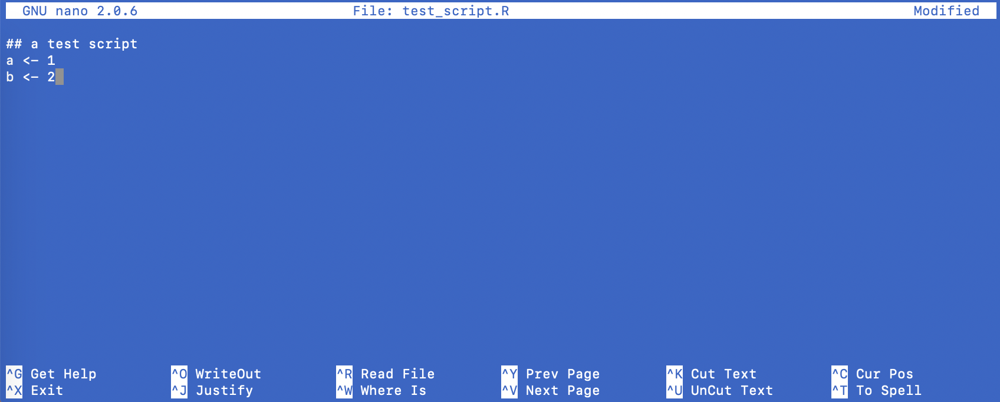
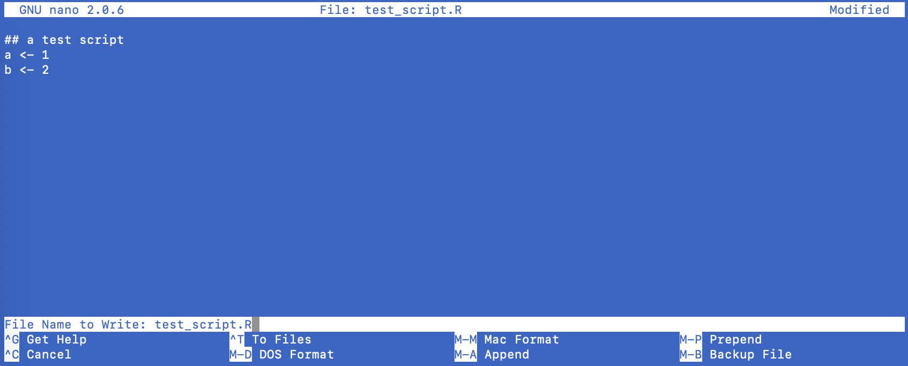
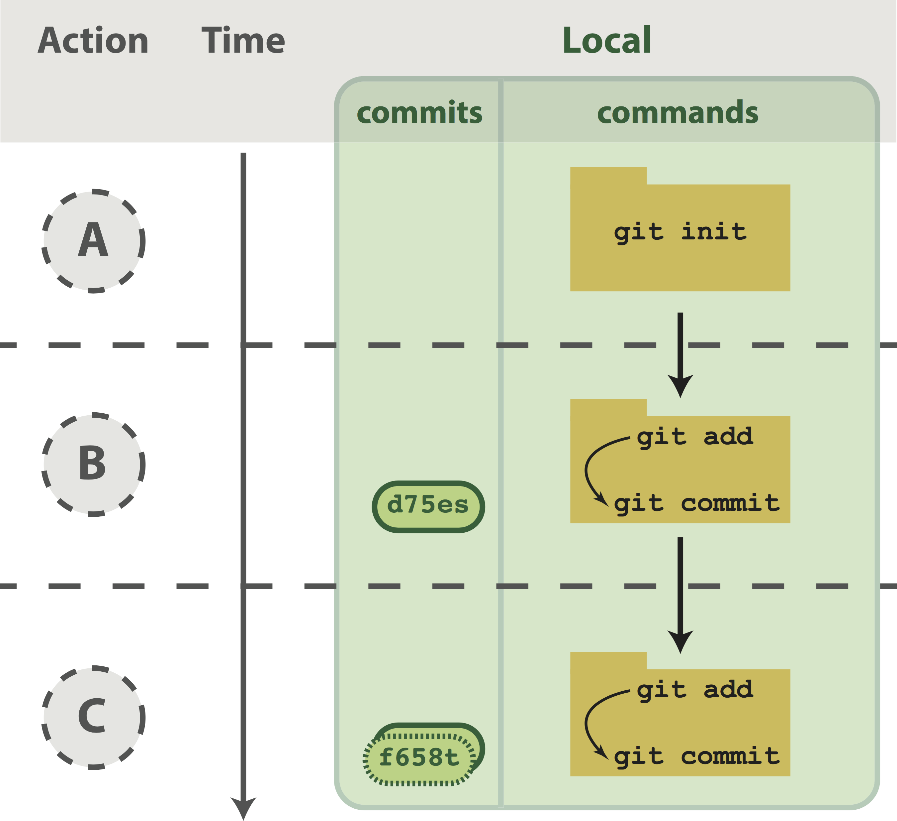
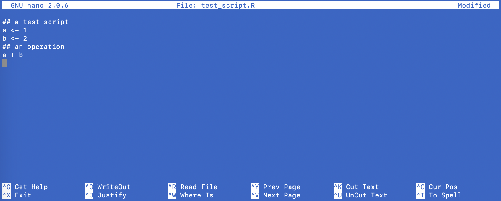
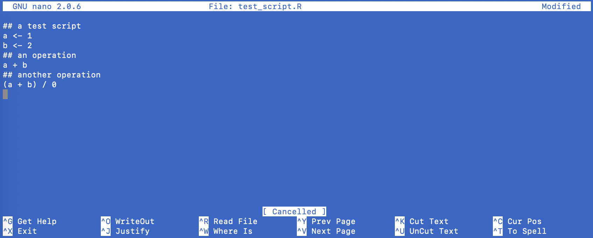

```{r setup, include=FALSE}
knitr::opts_chunk$set(echo = TRUE)
```

<br>

# What is Git?

Git is a version control software, which means it records changes to a file or set of files over time so that you can recall specific versions later. Git works by essentially taking snapshots of a file's contents over time, such that you can return to a old snapshot at some point in the future.

***

# Git vocabulary

<br>

**repository (repo)**: folder containing all tracked files as well as the version control history

**local**: a version of a repository stored on a personal computer

**remote**: a version of a repository stored on a remote server like GitHub

**branch**: a parallel version of the files in a repository

**clone**: download a copy of a remote repository to your personal computer

**stage (noun)**: the staging area holds the files to be included in the next commit  
**stage (verb)**: to mark a file to be included in the next commit

**commit (noun)**: a snapshot of changes made to the staged file(s)  
**commit (verb)**: save a snapshot of changes made to the staged file(s)

**fork (noun)**: a copy of another user's repository  
**fork (verb)**: to copy someone else's repository

**merge**: update files by incorporating the changes from new commits

**pull**: retrieve commits from a remote repository and merge them into a local repository

**push**: send commits from a local repository to a remote repository

**pull request**: a message sent by one GitHub user to another with a request to merge their commits from their remote repository into another user's remote repository

***

# Git commands

To begin, we will be using Git via the command line, which means having to type out each instruction. Every Git command begins with the word `git`. If you are running Mac OS, you'll use **Terminal**. If you are running Windows, you'll use the **Git Bash** app that comes with your installation of Git.

`git help`  
This will bring up the 21 most common Git commands. You can also type `git help blah` where `blah` is the name of a specific command to get more specific information.

`git config`  
Short for "configure", this is how you set up Git for the first time.

`git init`  
This initializes a new Git repository, which you will need to do inside a repository (directory) before Git will recognize it as something to track.

`git status`  
Check the status of your repository. See which files are inside it and which changes still need to be committed. This command also offers helpful hints about possible next steps (e.g., unstaging a commit).

`git add`  
This is a bit misleading as it doesn't actually add new files to your repository. Rather, it merely alerts Git to start paying attention to a file.

`git commit`  
This is *the most important* command, as it tells Git to take a snapshot of any changed files in the repository.

`git push`  
This moves ("pushes") changes from your local repo up to a remote repository like GitHub.

`git pull`  
This moves ("pulls") changes from a remote repository like GitHub to your local repo.

`git branch`  
This creates a new branch in the current repo.

`git checkout`  
This command has two uses: 1) inspect a new branch, and 2) discard any changes to a local file and revert it back to the way it was at the last commit.

`git merge`  
When you’re done working on a branch, you can merge your changes back to the master branch, which is visible to all collaborators. git merge cats would take all the changes you made to the “cats” branch and add them to the master.

***

# Using the command line

We'll start by using Git via its standard command line interface, which means you'll have to do a bit of typing. Begin by opening either **Terminal** (Mac OS) or **Bash** (Windows). The command shell will look a bit different depending on which OS you are using. In either case, `$` marks the beginning of the command line where you can start typing commands.

**Mac OS**

```sh
computername:~ username$
```

**Windows**

```sh
username@computername ~
$
```

The tilde `~` indicates that you are in your root directory. You can check check the full path name with `pwd`, which stands for "print working directory".

```sh
$ pwd
```

On a Mac this returns

```sh
/Users/username
```

***

# Configuring Git

Before using Git for version control, you'll need to configure it to use your name and email address. (Note that the following command line instructions will just begin with a `$` so as to be platform independent.) The first step is to tell Git who you are. 

<div class="boxy boxy-blue boxy-clipboard-list">
**Task:** Replace `first last` with your first and last names, and be sure to include the quotation marks.
</div>

```sh
$ git config --global user.name "first last"
```

The next step is to give Git your email address.

<div class="boxy boxy-blue boxy-clipboard-list">
**Task:** Replace `your_email` with your actual email address and again be sure to include the quotation marks.
</div>

```sh
$ git config --global user.email "your_email"
```

<div class="boxy boxy-blue boxy-clipboard-list">
**Task:** Verify that your user name and email are set correctly.
</div>

```sh
$ git config --list
```

***

# Setting up a repo

## Create a new folder

We'll begin by creating a new folder/directory from the command line.

<div class="boxy boxy-blue boxy-clipboard-list">
**Task:** Create a new directory called `tryout`.
</div>

```sh
$ mkdir ~/tryout
```

The function `mkdir` is short for "make directory"; it's not a Git command, so we don't have to preface it with `git`. The `~/` before `tryout` simply tells the operating system to create the new directory in the user's root directory.

<div class="boxy boxy-blue boxy-clipboard-list">
**Task:**  Change directories to the new `tryout` folder.
</div>

```sh
$ cd tryout
```

The command `cd` is short for "change directory". Notice that the `~` has now changed to `tryout` to indicate you are in the `tryout` folder.

**Mac OS**

```sh
computername:tryout username$
```

**Windows**

```sh
username@computername /c/tryout
$
```

<div class="boxy boxy-orange boxy-lightbulb">
**Tip:** You can type `ls` to list the contents of a directory.
</div>

**Input**

```sh
$ ls
```

**Output**

```sh
$
```

<div class="boxy boxy-red boxy-exclamation">
**Note:** In this case, nothing happened because the folder is empty.
</div>

## Initialize the repo

Before Git will start tracking the changes to files and folders, you need to "initialize" the project folder.

<div class="boxy boxy-blue boxy-clipboard-list">
**Task:**  Go ahead and initialize the folder.
</div>

**Input**

```sh
$ git init
```

**Output**

```sh
hint: Using 'master' as the name for the initial branch. This default branch name
hint: is subject to change. To configure the initial branch name to use in all
hint: of your new repositories, which will suppress this warning, call:
hint: 
hint: 	git config --global init.defaultBranch <name>
hint: 
hint: Names commonly chosen instead of 'master' are 'main', 'trunk' and
hint: 'development'. The just-created branch can be renamed via this command:
hint: 
hint: 	git branch -m <name>
Initialized empty Git repository in /Users/username/tryout/.git/
```

You can see that Git responded to your command with a helpful reminder about branch names. In the not so distant past, Git and GitHub used the term "master" to refer to the main branch of a repo. However, in light of the negative connotations of the word, many have advocated to change it to "main", so Git is suggesting you might want to do that as well.

<div class="boxy boxy-blue boxy-clipboard-list">
**Task:**  Go ahead and change your branch name to `main`.
</div>

<div class="boxy boxy-orange boxy-lightbulb">
**Tip:** The `-m` option for `git branch` is short for "rename".
</div>

**Input**

```sh
$ git branch -m main
```

**Output**

```sh
$
```

<div class="boxy boxy-red boxy-exclamation">
**Note:** `git branch` is another silent command, so it won't return anything.
</div>

<div class="boxy boxy-orange boxy-lightbulb">
**Tip:** The command `git status` will report all kinds of information related to the contents of a repo.
</div>

**Input**

```sh
$ git status
```

**Output**

```sh
On branch main

No commits yet

nothing to commit (create/copy files and use "git add" to track)
```

***

# Adding files

Before you can commit a file to the tracking history, you need to "add" it to the list of things for Git to track. To do so, we'll use `git add`, but at the moment our folder is empty so we need to populate it with something. We'll use a built-in text editor called **nano** to create a simple R script as an example.

<div class="boxy boxy-blue boxy-clipboard-list">
**Task:** Start **nano** with an empty file.
</div>

**Input**

```sh
$ nano test_script.R
```

You will see the software name in the upper left and the name of the file at the top (`File: test_script.R`). There is also a block cursor in the upper left and a note at the bottom that this is a new file (`[ New File ]`). There are also some commands listed at the bottom. The caret `^` refers to the "control" key on your keyboard, so for example, `control+X` will exit **nano** (the `X` can be lowercase `x`). (Note that your text and background color for **nano** may be different than the examples below.)


<br>

<div class="boxy boxy-blue boxy-clipboard-list">
**Task:** Add the following lines of code to your new test script.
</div>

**Input**

```sh
## a test script
a <- 1
b <- 2
```



<br>

You can see that now **nano** sees this file as modified as indicated in the upper right (`Modified`).

<div class="boxy boxy-blue boxy-clipboard-list">
**Task:** Press `control+X`, which will bring up a message asking if you want to save the modified file.
</div>

<div class="boxy boxy-blue boxy-clipboard-list">
**Task:** Press `Y` (or `y`) to save your changes.
</div>


<br>

<div class="boxy boxy-blue boxy-clipboard-list">
**Task:** Press `return` to accept the same file name you set at its creation.
</div>



<br>

At this point you will be returned to the regular terminal window.

<div class="boxy boxy-blue boxy-clipboard-list">
**Task:** Now that we have a new file in our `tryout` folder, check the status of Git.
</div>

**Input**

```sh
$ git status
```

**Output**

```sh
On branch main

No commits yet

Untracked files:
  (use "git add <file>..." to include in what will be committed)
	test_script.R

nothing added to commit but untracked files present (use "git add" to track)
```

<div class="boxy boxy-red boxy-exclamation">
**Note:** Here Git is reporting that `test_script.R` is "untracked" and it suggests that you use `git add` to track it.
</div>

<div class="boxy boxy-blue boxy-clipboard-list">
**Task:** Track the new file with `git add filename`, where `filename` is the name of our R script.
</div>

**Input**

```sh
$ git add test_script.R
```

**Output**

```sh
$
```

<div class="boxy boxy-red boxy-exclamation">
**Note:** `git add` is another silent command that doesn't return anything.
</div>

<div class="boxy boxy-blue boxy-clipboard-list">
**Task:** Check the status of our repo.
</div>

**Input**

```sh
$ git status
```

**Output**

```sh
On branch main

No commits yet

Changes to be committed:
  (use "git rm --cached <file>..." to unstage)
	new file:   test_script.R

```

<div class="boxy boxy-red boxy-exclamation">
**Note:** Git reports back that our new file `test_script.R` is "staged" and ready to be committed to the Git history.
</div>

### Other options for `git add`

So far we've added only one file at a time.

<div class="boxy boxy-orange boxy-lightbulb">
**Tip:** Here are some additional options for `git add` that afford you more flexibility in adding multiple files.
</div>

* `git add *.R` will stage all .R files  

* `git add data/` will stage the folder `data` and its contents

* `git add .` will stage all new and modified files, but does not remove any deleted files

* `git add -u` will stage all modified and deleted files, but does not stage any new files  

* `git add -A` stages all new, modified and deleted files

***

# Committing a file

Committing files in Git is the backbone of the whole version control process. To do so, we'll use `git commit` with some additional information about what we're committing via a "commit message". Commit messages should be "short but informative", which means they should include enough information to help you and others understand what was done without being verbose. Mark also recommends beginning your commit message with a past tense verb. Some examples might be:

* "created new R script for data ingest"  
* "started work on background info for analysis"
* "added new year of data to samples.csv"  

<div class="boxy boxy-blue boxy-clipboard-list">
**Task:** Commit your new R script and don't forget the quotes.
</div>

<div class="boxy boxy-orange boxy-lightbulb">
**Tip:** The `-m` flag stands for "message".
</div>

**Input**

```sh
$ git commit -m "created test R script"
```

**Output**

```sh
[main (root-commit) 5e40183] created test R script
 1 file changed, 3 insertions(+)
 create mode 100644 test_script.R
```

When we run `git commit`, Git takes everything we have told it to save by using `git add` and stores a copy permanently inside the special `.git` directory. This permanent copy is called a commit and its short identifier is `5e40183` (note that your commit will likely have a different identifier).

<div class="boxy boxy-blue boxy-clipboard-list">
**Task:** Check the status of your repo and see where things stand.
</div>

**Input**

```sh
$ git status
```

**Output**

```sh
On branch main
nothing to commit, working tree clean
```

Now Git is reporting that everything is up to date. 

<div class="boxy boxy-orange boxy-lightbulb">
**Tip:** If you want a report of your recent activity, you can ask Git to show you the project's history using `git log`.
</div>

<div class="boxy boxy-blue boxy-clipboard-list">
**Task:** Check the log.
</div>

**Input**

```sh
$ git log
```

**Output**

```sh
commit 5e401831a92cf9e6980d0ee78a19966d6b310b78 (HEAD -> main)
Author: First Last <email@domain.edu>
Date:   Fri Jan 13 09:05:06 2023 -0800

    created test R script
```

<div class="boxy boxy-red boxy-exclamation">
&nbsp; **Note:** The log lists all commits made to a repository in reverse chronological order, which includes::
<ul>
  <li>a full 40-character identifier (i.e., the "SHA-1 checksum"), starting with the same 7 characters as the short identifier printed by the `git commit` command we used earlier</li>
  <li>the commit author's name and email address</li>
  <li>the date/time stamp of when it was created</li>
  <li>the commit message passed to Git</li>
</ul>
</div>

### Summary

<div class="boxy boxy-success boxy-check">
&nbsp; **Success:** At this point you've seen how to
<ul>
  <li>initialize a Git repository</li>
  <li>add (stage) a file to be committed</li>
  <li>commit a file to the repository</li>
</ul>
</div>

This figure from [Blischak et al. (2018)](https://journals.plos.org/ploscompbiol/article?id=10.1371/journal.pcbi.1004668) shows that process graphically.

<br>



***

# Making changes to a file

Let's now imagine you wanted to return to the R script we created earlier and add some more lines of code, or make some changes to the existing code.

<br>

<div class="boxy boxy-blue boxy-clipboard-list">
**Task:** Use **nano** to edit our script.
</div>

**Input**

```sh
$ nano test_script.R
```

<div class="boxy boxy-blue boxy-clipboard-list">
**Task:** Add the following lines of R code to the script. When you are finished, press `control+x` to exit, followed by `y` to save the file, and `return` to accept the same file name.
</div>

```sh
## an operation
a + b
```



<br>

<div class="boxy boxy-orange boxy-lightbulb">
**Tip:** You can inspect the contents of a file from the terminal with `cat`.
</div>

<div class="boxy boxy-blue boxy-clipboard-list">
**Task:** Use `cat` to inspect your R script to make sure the changes took effect.
</div>

**Input**

```sh
$ cat test_script.R
```

**Output**

```sh
## a test script
a <- 1
b <- 2
## an operation
a + b

```

<div class="boxy boxy-blue boxy-clipboard-list">
**Task:** Check on the status of your repo.
</div>

**Input**

```sh
$ git status
```

**Output**

```
On branch main
Changes not staged for commit:
  (use "git add <file>..." to update what will be committed)
  (use "git restore <file>..." to discard changes in working directory)
	modified:   test_script.R

no changes added to commit (use "git add" and/or "git commit -a")
```

This output indicates that there is one file (`test_script.R`) that has been modified, but importantly, nothing has yet been added to the staging area. This is what the last line of the output is telling us.

<div class="boxy boxy-orange boxy-lightbulb">
**Tip:** Before adding a file to staging, it's a good idea to inspect the changes that were made to it. To do this in Git, we'll use `git diff`, which is short for "difference".
</div>

**Input**

```sh
$ git diff
```

**Output**

```sh
diff --git a/test_script.R b/test_script.R
index 05922e5..4cdf1a7 100644
--- a/test_script.R
+++ b/test_script.R
@@ -1,3 +1,6 @@
 ## a test script
 a <- 1
 b <- 2
+## an operation
+a + b
+
```

Hmm, this output is definitely a bit cryptic.

* The first line indicates that the Git output is similar to the Unix `diff` command comparing the old (`a/test_script.R`) and new (`b/test_script.R`) versions of the file.  
* The second line indicates which versions of the file Git is comparing (i.e., `05922e5` and `4cdf1a7` are their unique version-specific labels).  
* The third and fourth lines once again show the name of the file being changed (`test_script.R`).  
* The remaining lines show the actual differences and the lines on which they occur; the `+` sign in the first column shows the lines that were added most recently (note that the last line of the R script is blank).
    
All of this is good information and everything is okay.

<div class="boxy boxy-blue boxy-clipboard-list">
**Task:** Commit the new changes to our R script.
</div>

**Input**

```sh
$ git commit -m "added an addition operation to test R script"
```

**Output**

```sh
On branch main
Changes not staged for commit:
  (use "git add <file>..." to update what will be committed)
  (use "git restore <file>..." to discard changes in working directory)
	modified:   test_script.R

no changes added to commit (use "git add" and/or "git commit -a")
```

<div class="boxy boxy-red boxy-exclamation">
**Note:** We forgot to add our file to the staging area, so nothing happened. Git suggests that we either use `git add` and/or `git commit -a`. 
</div>

<div class="boxy boxy-orange boxy-lightbulb">
**Tip:** Let's use `git add` for now and return to the other option later. After adding the file, we can commit it.
</div>

**Input**

```sh
$ git add test_script.R
$ git commit -m "added an addition operation to test R script"
```

**Output**

```sh
[main 07eaad4] added an addition operation to test R script
 1 file changed, 3 insertions(+)
```

OK, it looks like that worked, but it's a good idea to check on the status of the repo to be sure.

**Input**

```sh
$ git status
```

**Output**

```sh
On branch main
nothing to commit, working tree clean
```

<div class="boxy boxy-success boxy-check">
**Success:** Everything seems to be in working order.
</div>

<div class="boxy boxy-orange boxy-lightbulb">
**Tip:** Once again, we can check out the history of what we've done so far.
</div>

**Input**

```sh
$ git log
```

**Output**

```sh
commit 07eaad4b2fcbe4be7068c47612dcc4f3f7c6373d (HEAD -> main)
Author: First Last <email@domain.edu>
Date:   Fri Jan 13 09:33:32 2023 -0800

    added an addition operation to test R script

commit 5e401831a92cf9e6980d0ee78a19966d6b310b78
Author: First Last <email@domain.edu>
Date:   Fri Jan 13 09:39:32 2023 -0800

    created test R script
```

Now we can see both of our commits, with the most recent one at the top.

<div class="boxy boxy-blue boxy-clipboard-list">
**Task:** Add another operation to your R test script with the following lines of code. (For now ignore the fact that this code is problematic--we'll return to that later.)
</div>

```sh
## another operation
(a + b) / 0
```

**Input**

```sh
$ nano test_script.R
```

**Output**



<br>

<div class="boxy boxy-blue boxy-clipboard-list">
**Task:** When you are finished, press `control+x` to exit and `y` to save the file with the same name.
</div>

<div class="boxy boxy-blue boxy-clipboard-list">
**Task:** Add this file and commit it.
</div>

**Input**

```sh
$ git add test_script.R
$ git commit -m "added a division operation to R test script"
```

**Output**

```sh
[main 17c1a74] added a division operation to R test script
 1 file changed, 2 insertions(+), 1 deletion(-)
```

***

# Reviewing file history

One of the major advantages to using a formal version control system like Git is that you can go back in time and examine changes that were made to files. We saw previously that we can use `git diff` to inspect the changes that were made to a staged file. Here we'll expand that functionality to look back further in time.

<br>

<div class="boxy boxy-blue boxy-clipboard-list">
**Task:** Examine the changes to our R script with `git diff`.
</div>

**Input**

```sh
$ git diff test_script.R
```

**Output**

```sh
$
```

<div class="boxy boxy-red boxy-exclamation">
**Note:** In this case there have been no new changes to our file, so the output is blank. 
</div>

Git refers to the most recent version of a file as its `HEAD`. Earlier versions of a file are referenced with the tilde `~` and an integer, such that `HEAD~1` is the version that immediately precedes the current version. Similarly, `HEAD~10` refers to the version 10 steps prior to the current version. 

<div class="boxy boxy-orange boxy-lightbulb">
**Tip:** We can use `git diff HEAD filename` to inspect changes to the current version, but in this case it will yield the same thing as `git diff filename`.
</div>

**Input**

```sh
$ git diff HEAD test_script.R
```

**Output**

```sh
$
```

<div class="boxy boxy-blue boxy-clipboard-list">
**Task:** Take a peek back at the version prior to your current version and compare their differences.
</div>

**Input**

```sh
$ git diff HEAD~1 test_script.R
```

**Output**

```sh
diff --git a/test_script.R b/test_script.R
index 4cdf1a7..faed447 100644
--- a/test_script.R
+++ b/test_script.R
@@ -3,4 +3,5 @@ a <- 1
 b <- 2
 ## an operation
 a + b
-
+## another operation
+(a + b) / 0
```

Here we can see that we deleted the blank line at the end of the script as indicated by the `-`, and replaced it with the 2 lines beginning with `## another operation`.

<div class="boxy boxy-blue boxy-clipboard-list">
**Task:** Go back and look at the changes relative to your first version of the script.
</div>

**Input**

```sh
$ git diff HEAD~2 test_script.R
```

**Output**

```sh
diff --git a/test_script.R b/test_script.R
index 05922e5..faed447 100644
--- a/test_script.R
+++ b/test_script.R
@@ -1,3 +1,7 @@
 ## a test script
 a <- 1
 b <- 2
+## an operation
+a + b
+## another operation
+(a + b) / 0
```

Here you can see that the first version had only 3 lines of code and since then we've added 4 new lines of code.

***

# Recovering an old version

Let's imagine we weren't happy with the current version of our test script because perhaps we broke something or we simply can't get it to work. Because Git is a version control system, we can easily restore files to a state they were in at some previous commit. 

<div class="boxy boxy-orange boxy-lightbulb">
**Tip:** We can use `git checkout` to restore a previous version of a file by referencing it with `HEAD~n` where `n` refers to the version we'd like.
</div>

The last operation we added to our file will clearly create some problems for us because it contains a divide-by-zero. 

<div class="boxy boxy-blue boxy-clipboard-list">
**Task:** Let's revert our script to the version just prior to that when everything was working properly.
</div>

**Input**

```sh
$ git checkout HEAD~1 test_script.R
```

**Output**

```sh
Updated 1 path from b478816
```

Hmm. That did something, but it's not immediately clear if it was what we wanted.

<div class="boxy boxy-blue boxy-clipboard-list">
**Task:** Use `cat` to inspect the script to see if it was indeed switched back to the prior version.
</div>

**Input**

```sh
$ cat test_script.R
```

**Output**

```sh
## a test script
a <- 1
b <- 2
## an operation
a + b

```

<div class="boxy boxy-success boxy-check">
**Success:** Our script is back to the previous working version. 
</div>

<div class="boxy boxy-blue boxy-clipboard-list">
**Task:** Check on the status of the directory.
</div>

**Input**

```sh
$ git status
```

**Output**

```sh
On branch main
Changes to be committed:
  (use "git restore --staged <file>..." to unstage)
	modified:   test_script.R

```

<div class="boxy boxy-orange boxy-lightbulb">
**Tip:** Once again Git is telling us that we still need to commit the changes to our file, so let's do that.
</div>

**Input**

```sh
$ git commit -m "changed test script back to version before division op"
```

**Output**

```sh
[main 2743b47] changed test script back to version before division op
 1 file changed, 1 insertion(+), 2 deletions(-)
```

<div class="boxy boxy-blue boxy-clipboard-list">
**Task:** Lastly, run `git status` again to make sure we've gotten everything cleaned up.
</div>

**Input**

```sh
$ git status
```

**Output**

```sh
On branch main
nothing to commit, working tree clean
```

<div class="boxy boxy-success boxy-check">
**Success:** Everything seems to be in proper working order!
</div>


***

# Git clients

It can be tricky to learn all of the ins and outs of Git, especially when typing a bunch of cryptic text into the command line. Fortunately, there are several graphical user interfaces (GUIs) for Git that help visualize what is being done. We'll see next time that RStudio offers a relatively simple interface to Git, but there are others that have much more functionality. I suggest reading Jenny Bryan's treatment of them [here](https://happygitwithr.com/git-client.html).

***

# Endnote

**Congratulations!**

You've now successfully done the following:

* Initialized a Git repository

* Staged and added files to be tracked

* Committed a file to the Git history

* Compared changes to previous versions of a file

* Reverted a file back to a previous state
