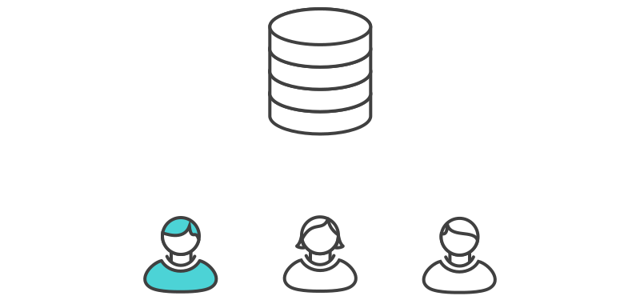
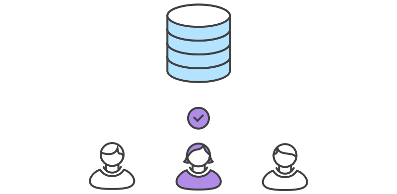

```{r setup, include=FALSE}
knitr::opts_chunk$set(echo = FALSE)
```

## Goals for today

* Understand different workflow models

> - Understand pros/cons of each


## What makes a successful workflow?

It *should* enhance the effectiveness of your team

It *should not* be a burden


## What makes a successful workflow? | Considerations

* Does this workflow scale with team size?

> - Is it easy to undo mistakes & errors?

> - Does it impose unnecessary overhead?


## Models for workflows

### Centralized

<br>

### Feature branch

<br>

### Forking


# Centralized workflow


## Centralized workflow | Uses a single repo for all changes to the project


## Centralized workflow | Juan works on his code




## Centralized workflow{data-background=images/central_diverge.svg data-background-position="50% 50%" data-background-size=90%}


## Centralized workflow | Mary works on her code


## Centralized workflow | Juan pushes his commits `(git push origin main)`


## Centralized workflow | Mary tries to push, but it fails  `(git push origin main)`


## Centralized workflow | Mary *rebases* `(git pull --rebase origin main)`


## Centralized workflow | `rebase` moves Mary's commits to tip


## Centralized workflow | Mary resolves her *merge conflict*


## Centralized workflow


```
git status
git add
git rebase --continue
```

## Centralized workflow | Mary pushes her commits `(git push origin main)`


## Centralized workflow | Pros and cons

* Easy for new team members to pick up

> - Can lead to lots of merge conflicts


# Feature branch workflow


## Feature branch workflow | How it works

* A central repo with a `main` branch for official history

> - Developers create a new branch for every new feature

> - Updates are made via *pull requests*


## Pull requests

* Changes are not immediately merged into `main` branch

> - Rather, the `feature` branch is pushed to remote repo

> - Changes are reviewed by the team

> - Accepted changes are merged into `main` and pushed to remote repo


## Feature branch | Mary creates a new development branch 


```
git checkout -b marys-feature main
```


## Feature branch | Mary pushes `(git push -u origin marys-feature)` 


## Feature branch | Mary finishes her changes & submits a pull request




## Feature branch | Juan receives pull request


## Feature branch | Juan & Mary discuss changes


## Feature branch | Mary makes changes


## Feature branch | Changes are accepted & merged (by Juan or Mary)


<br>

```
## switch to main branch
git checkout main
## pull changes from main
git pull
## pull changes from feature
git pull origin marys-feature
## push changes to main
git push 
```


## Feature branch workflow | Pros and cons

* Keeps development separate from production

> - Can be hard for beginners to understand


# Forking workflow


## Forking workflow | How it works

* Start with a central remote repo

> - Instead of cloning a repo, team members *fork* the repo, which creates a remote copy

> - Each team member then clones their remote fork to their local machine

> - [optional] A new local `feature` branch is created


## Forking workflow | How it works (cont'd)

* [optional] Team member makes changes on the `feature` branch

> - Commits are pushed to the developer's own remote copy

> - Team member opens a pull request from the (optionally `feature`) branch to the "official" repository

> - Pull request is approved & merged into the original remote repository


## Forking workflow | Pros and cons

* This is the preferred method for contributing to other packages/projects

> - Each team member has their own copy of the repo

> - It can be hard to keep track of others


## What's next?

We'll learn about best practices for creating, reading, and sharing data 


