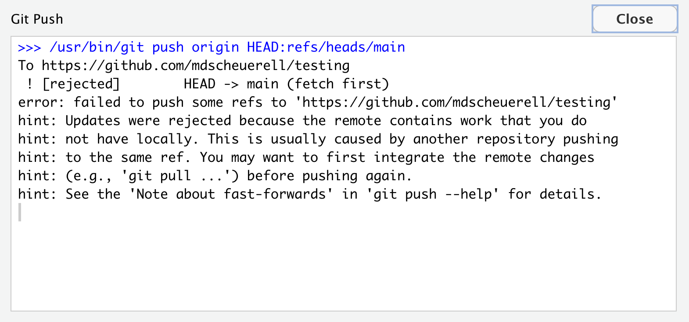
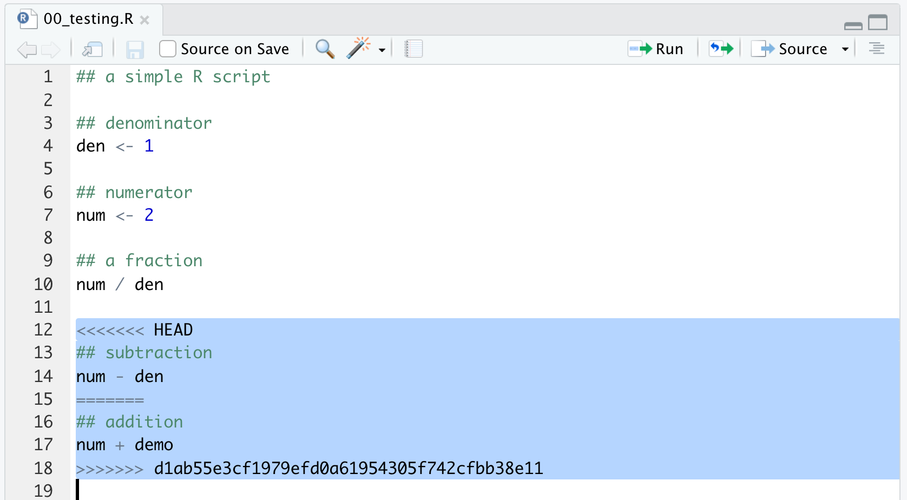

```{r setup, include=FALSE}
knitr::opts_chunk$set(echo = TRUE)
```

<br>

# Background

This document demonstrates some of the workflows we saw in class [here](https://fish549.github.io/website/lectures/week_03/lec_08_workflows.html). All of these workflows have some pros and cons. It's up to you and your team as to which one you adopt. Also note that your preferences might change, depending on the composition of your team and the task at hand.

***

# Centralized workflow

A centralized workflow uses a single repo for all changes to the project. All team members pull from and push to the same repo.

Imagine Juan sits down to work on his new **testing** project that Mary and Aisha have been working on as well. The first thing Juan does is **pull** from the remote repository.


<br>

Everything is up to date, so Juan works on the R script for doing some simple math operations. He adds 2 lines to the script to demonstrate a subtraction operation, and then saves his changes.


<br>

After basking in the glow of his wonderful new code, Juan decides he should take a break for awhile, so he commits his changes.


<br>


<br>

The last step before Juan takes a break is to **push** his local commit up to the shared repo on GitHub.



<br>

Oops--that did not go as expected!

What went wrong? Git is telling us that there are some changes on the remote repo that Juan does not have in his local copy. How did that happen? It turns out that Mary was also working on the project at the same time as Juan. In between the time that Juan sat down and pulled the changes from the remote repo (there were none at the time), Mary made some changes to the script, committed them, and pushed them to the remote repo. In looking at the error message from Git, Juan notices that it suggests he should **pull** the changes and integrate them into his own script.

Juan goes ahead and pulls Mary's recent changes to his local repo, which issues another warning about a so-called *merge conflict* in `R/00_testing.R` that Juan will have to fix.


<br>

## Merge conflicts

When Juan inspects his version of `00_testing.R` he sees that Git has added some information to the script, which brackets the new changes that both Juan and Mary made:

```{r eval = FALSE}
<<<<<<< HEAD
## subtraction
num - den
=======
## addition
num + demo
>>>>>>> d1ab55e3cf1979efd0a61954305f742cfbb38e11
```



<br>

<div class="boxy boxy-orange boxy-lightbulb">
**Tip:** You can think of these new lines as "conflict dividers".
</div>

The `=======` line is the center of the conflict.

Everything between `<<<<<<< HEAD` and `=======` is content that exists in the *local* repo to which the `HEAD` ref is pointing.

Everything between `=======` and `>>>>>>> d1ab55e3cf1979efd0a61954305f742cfbb38e11` is content that is present in the *remote* repo.

<div class="boxy boxy-orange boxy-lightbulb">
**Tip:** At this point, it would be a good idea for Juan to contact Mary and find out what her plans are, so he can avoid this problem in the future.
</div>

After confirming that Mary is done making changes for awhile, Juan can return to resolving the current merge conflict. To do so, Juan inspects the new changes that Mary made and decides if he wants to merge them into his version of the file, or whether he wants to discard them. In this case, Juan is happy with the new addition operation that Mary made, so he accepts them by simply deleting the conflict dividers.


<br>

Now Juan can commit his resolved changes and push them to the remote repo.


<br>


<br>

Now Juan is all set on his side, but Mary should make sure that she pulls Juan's changes to her local repo before she starts working on the script again.

<div class="boxy boxy-red boxy-exclamation">
**Note:** This scenario does not necessarily require two or more collaborators. 
</div>

For example, Mark knows from personal experience that someone can do some work on a computer in their office, commit those changes, and then forget to push them before heading home. Upon arriving home, they could pull their changes to their laptop, make additional changes, commit them, and then push them to the remote repo. Upon returning back to the office, they can encounter problems with committing and pushing those changes they forgot about the day before.

***

# Feature branch workflow

The feature branch workflow is designed around multiple *branches* within a repo. These branches can contain copies of files on the **main** branch, and are typically used for the development of specific features.

# Create a branch

Let's look at two different ways to create a new branch.

<div class="boxy boxy-blue boxy-clipboard-list">
**Task:** Review these instructions for creating a new branch from within GitHub, but don't follow through with them. We'll instead use the second approach shown below.
</div>

The first is from GitHub itself. To do so, navigate to the remote repo and click on the button marked **main** in the upper left. This will open a dialogue box with a line for you to find or create a branch. Type the name of the new branch (e.g., "develop") and then hit "return".


<br>

The second option for creating a new branch, which we'll follow here, is to do so from within RStudio.

<div class="boxy boxy-blue boxy-clipboard-list">
**Task:** Click on the purple button with 2 rectangles and a diamond in the **Git** pane, which will bring up a dialogue window where you can enter the name of your new branch (we'll call it "develop"). Press the **Create** button when you're done.
</div>


<br>

<div class="boxy boxy-red boxy-exclamation">
&nbsp; **Note:** At this point, you'll see a message window from Git with the following information:
<ul>
  <li>lines 1-2: Git created a new branch and switched over to it with `git checkout -B develop`</li>
  <li>lines 3-10: Git pushed all of your local files to a newly created `develop` branch on the remote GitHub repo.</li>
</ul>
You should also note that Git is suggesting you create a so-called *pull request* to move changes from the **develop** branch into the **main** branch by navigating to your remote repo on GitHub.
</div>
  


<br>

<div class="boxy boxy-orange boxy-lightbulb">
**Tip:** If you navigate back to the **testing** repo on GitHub and refresh your browser, you will see that there are now 2 branches there: main and develop.
</div>


<br>

Let's go ahead and make a small change to our R test script (note that the following assumes you have not already made these changes in the above section on **Centralized workflow**). After doing so, we'll commit and push the changes on the **develop** branch up to our remote repo on GitHub.

<div class="boxy boxy-blue boxy-clipboard-list">
**Task:** Add the following 2 lines of code to the `00_testing.R` script. Save the changes when you are finished.
</div>


<br>

<div class="boxy boxy-blue boxy-clipboard-list">
**Task:** Add the file to staging and commit it. Include a _short but informative_ commit message and click the **Commit** button when ready.
</div>


<br>

<div class="boxy boxy-blue boxy-clipboard-list">
**Task:** Click on the green uparrow next to "Push" to push your changes to GitHub.
</div>

<div class="boxy boxy-red boxy-exclamation">
**Note:** RStudio will pop open a window echoing your push command and the destination.
</div>


<br>

## Pull requests

Now let's take the advice we received earlier about creating a "pull request" (or "PR" for short). You can think of a pull request as an offer of support. In effect, someone who submits a pull request is kindly requesting that the repo owner pull new changes into their repo.

<div class="boxy boxy-blue boxy-clipboard-list">
**Task:** Navigate to your testing repo on GitHub.
</div>

<div class="boxy boxy-red boxy-exclamation">
**Note:** Upon arriving there, we see a message that "**develop** had recent pushes less than a minute ago". To the right of that is a green button marked **Compare & pull request**.
</div>


<br>

<div class="boxy boxy-blue boxy-clipboard-list">
**Task:** Click on the green **Compare & pull request** button, which will take you to a page to open a pull request.
</div>

<div class="boxy boxy-orange boxy-lightbulb">
**Tip:** At the top you will see some information about the branches from which and to where the changes will be merged, along with a note about the branches being okay to merge. If you scroll down the page, you'll see the changes that were committed, when they were made, and who did it.
</div>


<br>

<div class="boxy boxy-orange boxy-lightbulb">
**Tip:** If your pull request involves multiple files, features, etc, it's a good idea to include some additional information in the comment box (this can include Markdown flavored text).
</div>

<div class="boxy boxy-blue boxy-clipboard-list">
**Task:** Click on the green **Create pull request** button, which will take you to another page where you can review any comments (here there are none) and merge the pull request. In the middle of the page, you'll see a note about **This branch has no conflicts with the base branch** and a green button labeled **Merge pull request**. Go ahead and push that button.
</div>


<br>

At this point, the window will switch over to asking you to confirm the merge.

<div class="boxy boxy-blue boxy-clipboard-list">
**Task:** Go ahead and click on the green **Confirm merge** button.
</div>


<br>

After doing so, GitHub will now report **Pull request successfully merged and closed** (you'll also notice that the green **Open** oval below the name of the pull request has changed to a purple **Merged** oval). GitHub also tells you that "You’re all set--the **develop** branch can be safely deleted."


<br>

<div class="boxy boxy-orange boxy-lightbulb">
**Tip:** If your branch was created solely for the purpose of working on a specific feature, then you can go ahead and delete it. If, however, you want to maintain a development (or other) branch, then you can just ignore this message and keeping working on it as well.
</div>

***

# Forking workflow

Recall that a forking workflow is commonly used when a developer is *not* a member of the project/organization on GitHub. This workflow allows the developer to work with a copy of the owner's repo and potentially submit a pull request for the owner to consider adopting the changes.

## Step 1: Fork the repo


<br>

To fork a repo, navigate to its location on GitHub and look for the **Fork** button in the upper right. Press that button, which will bring up a dialogue box asking you where you would like to fork the repo. Click on the user or organization where you'd like to fork the repo and GitHub will do the rest.


<br>

<div class="boxy boxy-red boxy-exclamation">
**Note:** When you click on the **Fork** button, GitHub will open a page that looks similar to when you create a new repo.
</div>

<div class="boxy boxy-blue boxy-clipboard-list">
**Task:** Click the green **Create fork** button to proceed.
</div>


<br>

You will now see a new forked version of the original repository with some information in the upper left about its location and from where it came. You'll also see some information above the repo contents about the current branch being up to date with the "upstream" source.


<br>

<div class="boxy boxy-red boxy-exclamation">
**Note:** In the not so distant past, you had to use Git via the command line to specify where the "upstream" repo of a fork was and then "fetch" any changes. GitHub has now streamlined that process by providing a "sync fork" button to do so (see below).
</div>


<br>


## Step 2: Clone the repo


<br>

<div class="boxy boxy-blue boxy-clipboard-list">
**Task:** Clone the remote GitHub repo to a local repo by creating a new project in RStudio based upon your newly forked repo. Click [here](https://fish549.github.io/website/lectures/week_02/lec_06_git_remotes.html) if you need a reminder as to how to do that.
</div>

<br>

## Step 3: Add remote repo


<br>

At this point, your local copy of the remote repo can only pull changes from your remote at 

`https://github.com/USERNAME/ex-fork`

where `USERNAME` is your GitHub username. Unfortunately there is no way to update your remote repo directly from the owner's repo at

`https://github.com/FISH549/ex-fork`.

Instead, we have to set up our local repo to pull changes from the owner's remote repo and then we can push those up to our remote copy. By convention, we will refer to the owner's repo as the `upstream` repo, but you could give it any name.

At this point you have 2 options for adding the `upstream` repo.

### Option 1: Command line

<div class="boxy boxy-blue boxy-clipboard-list">
**Task:** Click on the **Terminal** tab in your RStudio console window and type (or copy/paste) the following Git command:
</div>

```sh
git remote add upstream https://github.com/FISH549/ex-fork
```

### Option 2: RStudio

<div class="boxy boxy-blue boxy-clipboard-list">
**Task:** Open up your project in RStudio and click on the "New branch" button in the **Git** pane (i.e., the button with the 2 purple rectangles and a diamond).
</div>


<br>

<div class="boxy boxy-blue boxy-clipboard-list">
**Task:** Click on the button labeled "Add remote...".
</div>


<br>

<div class="boxy boxy-blue boxy-clipboard-list">
**Task:** In the "Remote Name:" box, type `upstream`. In the "Remote URL:" box, enter the name of the **owner's** repo you forked in Step 1: `https://github.com/FISH549/ex-fork` (you can copy/paste if you'd like). When you are finished, click the **Add** button.
</div>


<br>

<div class="boxy boxy-blue boxy-clipboard-list">
**Task:** Click on the **Cancel** button (don't worry, everything is still OK).
</div>


<br>

<div class="boxy boxy-blue boxy-clipboard-list">
**Task:** Now you need to verify that the remote `upstream` is set up properly. To do so, click on the **Terminal** tab in your Console pane and type this:
</div>

```sh
$ git remote -v
```

which should return the following, where `USERNAME` is your user name.

```sh
origin  https://github.com/USERNAME/ex-fork (fetch)
origin  https://github.com/USERNAME/ex-fork (push)
upstream        https://github.com/FISH549/ex-fork (fetch)
upstream        https://github.com/FISH549/ex-fork (push)
```

<br>


<br>

## Step 4: Make local changes


<br>

Now you are ready to make any changes you'd like to the files or folders in your local repo.  

<div class="boxy boxy-orange boxy-lightbulb">
**Tip:** **Before doing so**, make sure to **pull** any changes that might have been made to the owner's `upstream` remote.
</div>

<div class="boxy boxy-blue boxy-clipboard-list">
**Task:** To do so, again navigate to the **Terminal** tab in RStudio and type:
</div>

```sh
$ git pull upstream main --ff-only
```

If nothing has changed, you'll see a message like this:

```
From https://github.com/FISH549/ex-fork
 * branch            main       -> FETCH_HEAD
 * [new branch]      main       -> upstream/main
Already up to date.
```

### Setting the local branch

If you examine your forked copy of the repo on GitHub, you'll notice that it contains 2 branches: **main** and **develop**. However, if you inspect the local branches in your current project in RStudio, you'll see that only **main** exists there.


<br>

<div class="boxy boxy-orange boxy-lightbulb">
**Tip:** To set the local branch to **develop** (where we'd like to do our work), click on **develop** under (REMOTE: ORIGIN), which will bring up a message box from Git informing you that you've created and switched over to a new branch called **develop**.
</div>


<br>


<br>

<div class="boxy boxy-blue boxy-clipboard-list">
**Task:** Close the window and you will see that the branch name in the **Git** pane of RStudio is set to **develop**. 
</div>

<div class="boxy boxy-orange boxy-lightbulb">
&nbsp; **Tip:** If you again click on the **develop** button it will now show that you can track the **develop** and **main** branches on
<ul>
  <li>your local repo</li>
  <li>your remote origin (located at `https://github.com/USERNAME/ex-fork`)</li>
</ul>
You can also track the **main branch** on the remote upstream (located at `https://github.com/FISH549/ex-fork`)
</div>


<br>

Let's create a new file in our local repo so we have something to commit and push to our own remote repo, and then ultimately submit it as a pull request to the original repo's owner (here `FISH549`).

<div class="boxy boxy-blue boxy-clipboard-list">
**Task:** Go ahead and make a simple R script and commit it (I'm called mine `simple_addition.R`).
</div>


<div class="boxy boxy-blue boxy-clipboard-list">
**Task:** When you're happy with your script, go ahead and commit it.
</div>


<br>

## Step 5: Push to GitHub


<br>

Now it's time to push your simple script to your own remote located at

`https://github.com/USERNAME/ex-fork`

<div class="boxy boxy-blue boxy-clipboard-list">
**Task:** Click the green uparrow to push your new script to GitHub.
</div>


<br>

## Step 6: Submit a pull request


<br>

<div class="boxy boxy-blue boxy-clipboard-list">
**Task:** Navigate to your forked repo on GitHub where you'll see a message about this branch having a recent push and a new green button labeled **Compare & pull request**.
</div>


<br>

<div class="boxy boxy-blue boxy-clipboard-list">
**Task:** Open a pull request by clicking on the green **Compare & pull request** button.
</div>
 
<div class="boxy boxy-red boxy-exclamation">
&nbsp; **Note:** This will take you to the standard page for a pull request, just as we saw in the [feature branch workflow](#feature-branch-workflow) above. In this case, however, there is additional information about 2 things:
<ol>
  <li>the location of the upstream repo  (here it's `https://github.com/FISH549/ex-fork`)</li>
  <li>the *locations* and *branches* (here **develop**) of the base and head repositories</li>
</ol>
</div>


<br>

<div class="boxy boxy-orange boxy-lightbulb">
**Tip:** It's good practice to give your pull request an informative title and include some additional information about the substance of the pull request, so that the owner of the original repo has some understanding of what you've done.
</div>

<div class="boxy boxy-blue boxy-clipboard-list">
**Task:** Give your pull request a title and description. When ready, click on the green **Create pull request** button, which will take you to a page showing the details of your pull request.
</div>
 


<br>


<br>

<div class="boxy boxy-success boxy-check">
**Success:** No you just have to wait for the repo's owner to review the pull request and either accept it as is, or come back to you with additional comments or requests for changes.
</div>


