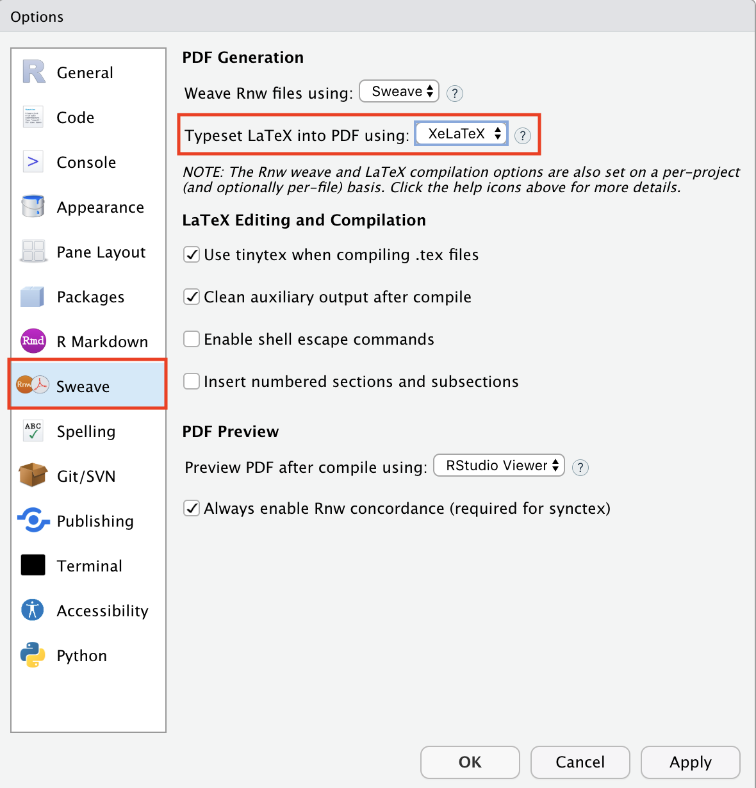
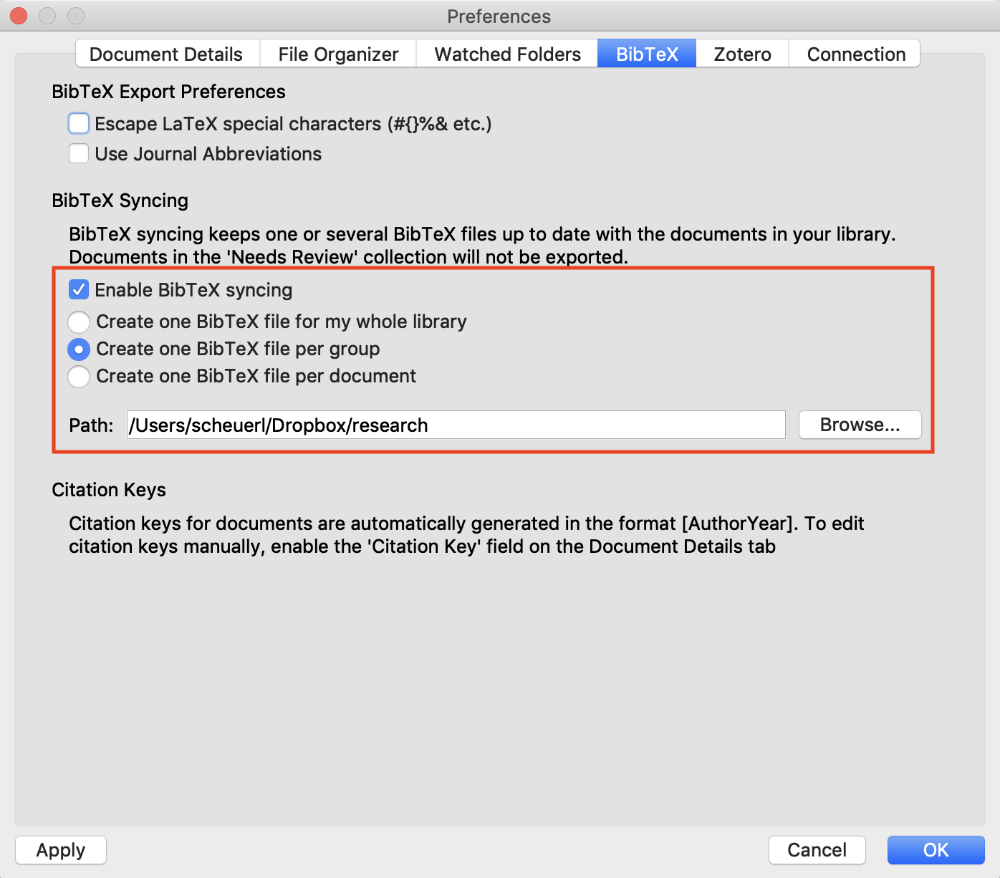
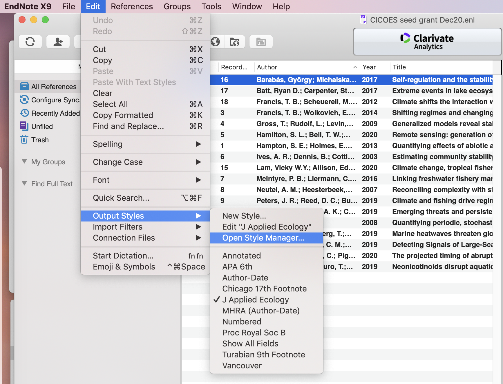
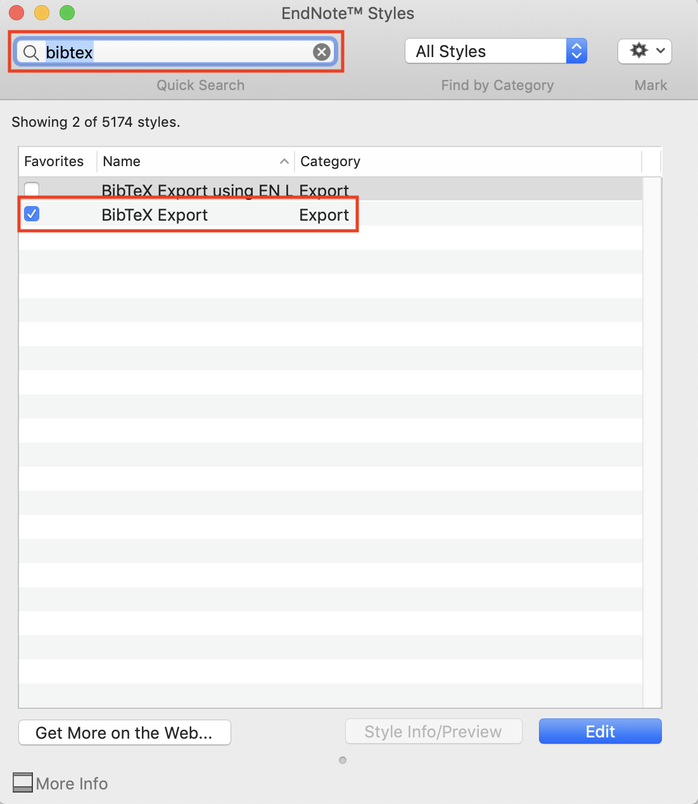
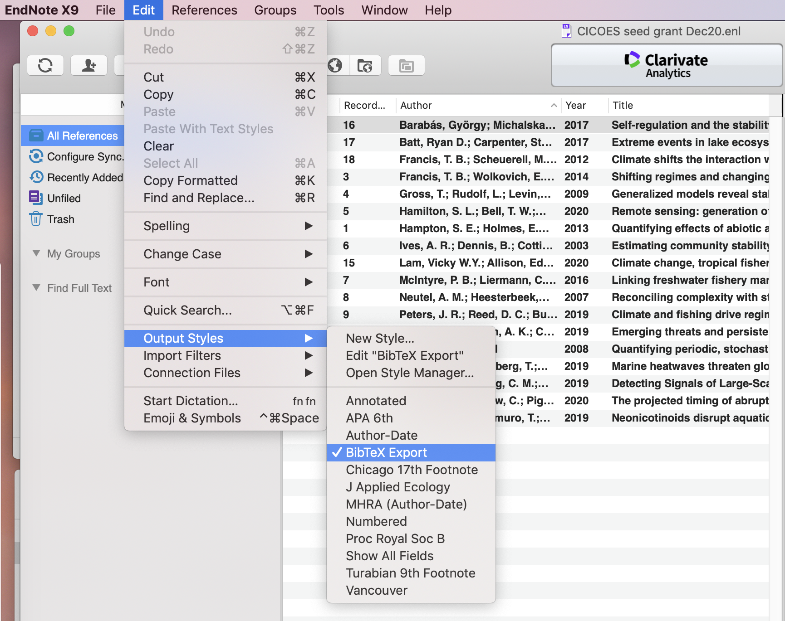
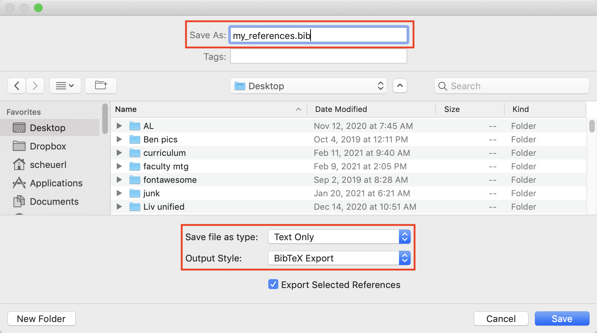

```{r setup, include=FALSE}
knitr::opts_chunk$set(echo = TRUE)
```

***

# Background

We saw [last time](lec_20_markdown_1.html) how to work with some of the basic formatting options when creating `.html` files in **R Markdown**. Here we will learn about some of the more advanced formatting options for creating nice looking documents. You should download the blank `.Rmd` template [here](rmd_pdf_blank_template.Rmd), which contains some random text and other output options.

***

# Basic info

The basic information in the `YAML` of a blank `.Rmd` document set for `.pdf` output includes the following.

```{r yaml, eval = FALSE}
title: "A catchy title"
author: "First Last"
date: "13 February 2023"
output: pdf_document
```

<div class="boxy boxy-orange boxy-lightbulb">
**Tip:** You can also add a subtitle with the `subtitle` argument and set the data to automatically update with the inline **R** code `Sys.Date()`. You can create a custom format for the date as well.
</div>

For example, the following `date` option will print as `day full_month_name four_digit_year`. Check out the options for the R function `format()` to see how to change the date format.

```{r yaml_2, eval = FALSE}
title: "A catchy title"
subtitle: "A pithy subtitle"
author: "First Last"
date: "`r format(Sys.time(), '%d %B %Y')`"
output: pdf_document
```


***

# Document layout

The default document layout for `.pdf` files in **R Markdown** is pretty good, but there are some options to improve it. These options are specified primarily in the document's `YAML`, but some of them will be placed in the "chunk options" within **R** code blocks.

## Appearance

We can change the overall appearance or *class* of the document with the `documentclass` argument, which you set in the `YAML`. Here are some of the options.

### Article

The `article` class is a basic layout that has relatively large margins.

```{r article, eval = FALSE}
title: "Example template for exploring formatting options"
author: "First Last"
date: "2/13/2023"
output: pdf_document
documentclass: article
```

### Report

The `report` class will create a separate title page and insert page breaks between level-one section headings. It also has relatively large margins.

```{r report, eval = FALSE}
title: "Example template for exploring formatting options"
author: "First Last"
date: "2/13/2023"
output: pdf_document
documentclass: report
```

### Two columns

You can create a document with two columns of text with the `classoption` argument. For example, here is an article with two columns.

```{r twocolumn, eval = FALSE}
title: "Example template for exploring formatting options"
author: "First Last"
date: "2/13/2023"
output: pdf_document
documentclass: report
classoption: twocolumn
```


## Margins

You can set the margin spacing to be the same for all four sides, or set each of them separately, with the `geometry` argument. Here is an example of setting all of the margins in an `article` to 1.5 inches.

```{r margins_1, eval = FALSE}
title: "Example template for exploring formatting options"
author: "First Last"
date: "2/13/2023"
output: pdf_document
documentclass: article
geometry: margin=1.5in
```

Here's an example of setting the top and bottom margins in an `article` to 1 inch and the left and right margins to 1.25 inches.

<div class="boxy boxy-red boxy-exclamation">
**Note:** When using multiple settings in an argument, we need to set them on separate lines preceded by a dash `-`.
</div>

```{r margins_2, eval = FALSE}
title: "Example template for exploring formatting options"
author: "First Last"
date: "2/13/2023"
output: pdf_document
documentclass: article
geometry:
- top=1in
- bottom=1in
- left=1.25in
- right=1.25in
```

<div class="boxy boxy-orange boxy-lightbulb">
**Tip:** You can also use metric units for margins.
</div>

## Line spacing

You can increase the line spacing with the `linestretch` argument. For example, here is an `article` with 1-inch margins and double line spacing.

```{r line_spacing, eval = FALSE}
title: "Example template for exploring formatting options"
author: "First Last"
date: "2/13/2023"
output: pdf_document
documentclass: article
geometry: margin=1in
linestretch: 2
```

## Line numbers

You can add line numbers to `.pdf` documents, but it involves using an additional **LaTeX** package call `lineno`.

<div class="boxy boxy-red boxy-exclamation">
**Note:** To use additional **LaTeX** packages, you have to set the `header-includes` argument in the `YAML`. 
</div>

For example, it looks like this for a double-spaced article with 1-inch margins:

```{r line_numbers, eval = FALSE}
title: "Example template for exploring formatting options"
author: "First Last"
date: "2/13/2023"
output: pdf_document
documentclass: article
geometry: margin=1in
linestretch: 2
header-includes:
  - \usepackage{lineno}
  - \linenumbers
```


## Fonts

### Size

You can set the font size in your document with the `fontsize` argument. For example, here is a double-spaced article with 1-inch margins and 12-point font.

```{r font_size, eval = FALSE}
title: "Example template for exploring formatting options"
author: "First Last"
date: "2/13/2023"
output: pdf_document
documentclass: article
geometry: margin=1in
linestretch: 2
fontsize: 12pt
```

### Family

You can change the font family, but doing so depends on the **LaTeX** engine you are using.

<div class="boxy boxy-orange boxy-lightbulb">
**Tip:** You can check your **LaTeX** engine by examining the **Global options** in **RStudio**.
</div>

<div class="boxy boxy-blue boxy-clipboard-list">
**Task:** Click on **Tools > Global Opotions...** In the dialogue box, select the **Sweave** option on the left and look at the setting for **Typeset LaTeX into PDF using**.
</div>

```{r, echo = FALSE, out.width = "80%", fig.align = "center"}

```

<div class="boxy boxy-red boxy-exclamation">
**Note:** If your **LaTeX** distribution is **TinyTeX** and the required font packages have not been installed, they should be automatically installed when the document is knitted.
</div>

<br>

#### Settings for `pdflatex`

<div class="boxy boxy-orange boxy-lightbulb">
**Tip:** If you are using **pdflatex**, you can use the `fontfamily` argument to select a **LaTeX** font package to be loaded in your document to change the font. Also note that this requires you to use multi-line option specification for `output` like we saw for `geometry` above.
</div>

For example, this document will use the Arial font.

```{r font_fam_1, eval = FALSE}
title: "Example template for exploring formatting options"
author: "First Last"
date: "2/13/2023"
output:
  pdf_document: 
    latex_engine: pdflatex
fontfamily: Arial
documentclass: article
geometry: margin=1in
linestretch: 2
fontsize: 12pt
```

<br>

#### Settings for `XeLaTeX`

<div class="boxy boxy-orange boxy-lightbulb">
**Tip:** If you using **XeLaTeX** or **luaLaTeX**, you will be able to select fonts that are available on your local computer, and do not have to install additional **LaTeX** packages. To do so, use the `mainfont` argument.
</div>

```{r font_fam_2, eval = FALSE}
title: "Example template for exploring formatting options"
author: "First Last"
date: "2/13/2023"
output:
  pdf_document: 
    latex_engine: xelatex
mainfont: Arial
documentclass: article
geometry: margin=1in
linestretch: 2
fontsize: 12pt
```


***

# Front matter

You can add so-call *front matter* to your document, such as a table of contents.

## Table of contents

To automatically create a table of contents, set the `toc` argument to `true`. You can control how many heading levels you want to display in the table of contents with the `toc-depth` argument. For example, here is a double-spaced `report` with 1-inch margins, 12-point font, and a table of contents that shows the first two heading levels.

```{r toc, eval = FALSE}
title: "Example template for exploring formatting options"
author: "First Last"
date: "2/13/2023"
output: pdf_document
documentclass: report
geometry: margin=1in
linestretch: 2
fontsize: 12pt
toc: TRUE
toc-depth: 2
```

## Document version

For some documents, I prefer to set a custom *version* number based on the date rather than set the `date` argument explicitly. To do so, simply include a line in the *main document* (not in the YAML) similar to something like this:

```{r version, eval = FALSE}
This is version `r paste0('0.',format(Sys.time(), '%y.%m.%d'))`.
```

that will render to

> This is version `r paste0('0.',format(Sys.time(), '%y.%m.%d'))`.

***

# Figure placement

Unlike Microsoft Word, in which figures are placed directly where the user specifies, **LaTeX** will attempt to place a figure in a position that does not violate certain typographic rules. Thus, figures may "float away" from where they are referenced in the text. These so-called *floats* are used as containers for figures (and tables) that cannot be broken across pages.

In R Markdown, figures are actually generated with the figure environment in **LaTeX**. For example, Pandoc will convert the following Markdown code for specifying an image

```{r, eval = FALSE}

```

to the following **LaTeX** code:

```{r, eval = FALSE}
\begin{figure}
  \includegraphics{images/my_picture.jpg}
  \caption{This is an image.}
\end{figure}
```


<div class="boxy boxy-red boxy-exclamation">
**Note:** If the figure or table cannot be contained in the space remaining on the current page, **LaTeX** will try to place it at the top of the next page. If the figure is tall enough, it may occupy the whole next page, even if there is still space left for a few lines of text.
</div>

<div class="boxy boxy-orange boxy-lightbulb">
**Tip:** The float's behavior can be controlled by using placement controls in square brackets like `\begin{figure}[]`.
</div>

Here are some possible controls:

* `h`: Place the float here (or close to it)    
* `t`: Position at the top of the page  
* `b`: Position at the bottom of the page  
* `p`: Put on a special page for floats only  

<div class="boxy boxy-orange boxy-lightbulb">
**Tip:** You can override the default placement by prefacing the control with an exclamation point (eg, `[!t]`).
</div>

If you want to place the float at *exactly the location* in the **LaTeX** code, you will need to include a call to the `float` package in the `YAML`

```{r float, eval = FALSE}
title: "Example template for exploring formatting options"
author: "First Last"
date: "2/13/2023"
output: pdf_document
documentclass: article
geometry: margin=1in
linestretch: 2
fontsize: 12pt
toc: TRUE
toc-depth: 2
header-includes:
  - \usepackage{float}
```

<!-- and then later in the document use `fig.pos = "!H"` in the chunk options of a code block. For example, -->

<!-- ````{r, eval = FALSE} -->
<!-- ```{r some_plot, fig.pos = "!H"} -->
<!-- plot(1:10, pch = 16) -->
<!-- ``` -->
<!-- ```` -->

<!-- # Sub-figures -->

<!-- Sometimes you may want to include multiple images in a single figure environment. Sub-figures allow us to achieve this by arranging multiple images within a single environment and providing each with its own sub-caption.  -->

<!-- <div class="boxy boxy-red boxy-exclamation"> -->
<!-- **Note:** Sub-figures require the **LaTeX** package `subfig`, which you can call in the YAML. -->
<!-- </div> -->

<!-- ```{r subfigs, eval = FALSE} -->
<!-- title: "Example template for exploring formatting options" -->
<!-- author: "First Last" -->
<!-- date: "2/13/2023" -->
<!-- output: pdf_document -->
<!-- documentclass: article -->
<!-- geometry: margin=1in -->
<!-- linestretch: 2 -->
<!-- fontsize: 12pt -->
<!-- toc: TRUE -->
<!-- toc-depth: 2 -->
<!-- header-includes: -->
<!--   - \usepackage{subfig} -->
<!-- ``` -->

<!-- To arrange all plots from a code chunk into sub-figures, you have to set the following chunk options -->

<!-- * `fig.cap`: the caption for the whole figure environment -->

<!-- * `fig.subcap`: a `character` vector of the captions for each of the sub-figures -->

<!-- In addition, you will probably want to set the following options -->

<!-- * `fig.ncol`: number of columns of sub-figures (by default, all plots are arranged in a single row) -->

<!-- * `out.width`: output width of individual plots, which normally equals 100% divided by the number of columns -->

<!-- For example, this code chunk will produce 3 subplots: -->

<!-- ````{sh, eval = FALSE} -->
<!-- ```{r subplot, fig.cap = 'A figure with 3 subplots.', fig.subcap = c('The numbers 1 through 10.', 'Speed versus distance.', 'Time series of white noise.'), fig.ncol = 2, out.width = "50%", fig.align = "center", echo = FALSE} -->
<!-- plot(1:10, pch = 16) -->
<!-- plot(cars) -->
<!-- plot.ts(rnorm(30)) -->
<!-- ``` -->
<!-- ```` -->

<!-- *** -->

<!-- # Headers & footers -->

<!-- You can use the **LaTeX** package `fancyhdr` to customize the header and footer of your document. As with other packages, we have to first make a call to it in the YAML, and then set the additional argument `\pagestyle{fancy}` in the *body* of the document (not in the YAML). -->

<!-- For example, you could set the YAML like this -->

<!-- ```{r headfoot, eval = FALSE} -->
<!-- title: "Example template for exploring formatting options" -->
<!-- author: "First Last" -->
<!-- date: "2/13/2023" -->
<!-- output: pdf_document -->
<!-- documentclass: article -->
<!-- geometry: margin=1in -->
<!-- linestretch: 2 -->
<!-- fontsize: 12pt -->
<!-- toc: TRUE -->
<!-- toc-depth: 2 -->
<!-- header-includes: -->
<!-- - \usepackage{fancyhdr} -->
<!-- ``` -->

<!-- and then make this call near the top of the document *after* the YAML: -->

<!-- ```{r, eval = FALSE} -->
<!-- \pagestyle{fancy} -->
<!-- ``` -->

<!-- ## Header & footer syntax -->

<!-- The syntax for formatting the header or footer is -->

<!-- * `\fancyhead[selectors]{output text}` or -->

<!-- * `\fancyfoot[selectors]{output text}` -->

<!-- where `selectors` specify the part of the header that we wish to customize and `output text` is the text you'd like to include. We can use the following selectors for the page locators: -->

<!-- * `E` for even pages   -->
<!-- * `O` for odd pages   -->
<!-- * `L` for the left side   -->
<!-- * `C` for the center   -->
<!-- * `R` for the right side   -->

<!-- For example, `\fancyhead[LE,RO]{First Last}` will print the text “First Last” on the left side of the header for even pages, and the right side for odd pages. -->

<!-- ## Additional information -->

<!-- We can include additional LaTeX commands to extract details from our document for each page. These include -->

<!-- * `\thepage`: the number of the current page     -->
<!-- * `\thechapter`: the number of the current chapter   -->
<!-- * `\thesection`: the number of the current section   -->
<!-- * `\chaptername`: the word “Chapter” in English, or its equivalent in the current language, or the text that the author specified by redefining this command   -->
<!-- * `\leftmark`: the name and number of the current top-level structure in uppercase letters   -->
<!-- * `\rightmark`: the name and number of the current next to top-level structure in uppercase letters   -->

<!-- For example, the following code will place the text  -->

<!-- * "The document header" at the top center of all pages, -->
<!-- * "A fancy footer" at the bottom center of all pages, and -->
<!-- * the page number on the left of even pages and right of odd pages -->

<!-- ```{r, eval = FALSE} -->
<!-- \pagestyle{fancy} -->
<!-- \fancyhead[CO,CE]{The document header} -->
<!-- \fancyfoot[CO,CE]{A fancy footer} -->
<!-- \fancyfoot[LE,RO]{\thepage} -->
<!-- ``` -->

<!-- <div class="boxy boxy-orange boxy-lightbulb"> -->
<!-- **Tip:** By default, headers and footers are not displayed on the first page of a `.pdf` document. If you want to include them, use this line `\fancypagestyle{plain}{\pagestyle{fancy}}`. -->
<!-- </div> -->

***

# Literature cited

You can create in-text citations and associated literature cited sections (bibliographies) in **R Markdown** with a few easy steps.

## YAML setup

The first step in getting properly formatted citations and references in **R Markdown** documents is to add two fields to the document's YAML:

1) `bibliography:` the name of of the `.bib` file containing the citation/reference information (see below);

2) `csl:` the name of the `.csl` style file that specifies how the references will be formatted in the printed docuement.

So, for example, the information for this document is

```{r, eval = FALSE}
bibliography: "references.bib"
csl: "ecology.csl"
```

Each entry in the `.bib` file looks something like this:

```
@Book{Xie_2018,
  title = {R Markdown: The Definitive Guide},
  author = {Yihui Xie and J.J. Allaire and Garrett Grolemund},
  publisher = {Chapman and Hall/CRC},
  address = {Boca Raton, Florida},
  year = {2018},
  note = {ISBN 9781138359338},
  url = {https://bookdown.org/yihui/rmarkdown},
}
```

`@Book` specifies the reference is a book. `Xie_2018` is the "citekey", which is simply a short-hand name for the record (and can be alpha-numeric sequence); it's used when making/creating in-text citations (see below). The rest of the fields contain metadata about the reference itself.

This document is set to use the style guidelines for the journal _Ecology_, as specified in `ecology.csl`.

<div class="boxy boxy-orange boxy-lightbulb">
**Tip:** You can download just about any journal's style file [here](https://www.zotero.org/styles).
</div>

At this point there are two options for setting up your **BibTeX** file and creating in-text citations.

## Option 1: Standard Markdown

### Creating a `.bib` file

One option for creating a `.bib` file is to copy/paste records from other sources (e.g., the result of call to `citation()`). Online databases such as Web of Science also allow you to export references based upon saved searches, and there are several methods for exporting references from reference management software, such as **Zotero**, **Mendeley**, or **EndNote**.

#### Export from Zotero

To export your citations from **Zotero**, do the following

* Select the library you wish to export  
* From the menu, choose  `File > Export Library`  
* On the next screen, choose `BibTeX` from the dropdown menu & click `OK`  
* Navigate to the directory where you want to save your file & save it with a `.bib` suffix  

#### Export from Mendeley

To export a reference library from **Mendeley**, do the following

* Go to the Mendeley `Preferences` menu  

* Click on the BibTeX tab  

* Check the box next to `Enable BibTeX syncing`  

* Click the radio button next to `Create one BibTeX file per group`

* Change the `Path` to your desired location for the library files

* Click **OK** when you are finished



<br>

#### Export from EndNote

To export a reference library from **EndNote**, do the following

* From the main menu, select `Edit > Output Styles > Open Style Manager...`



* Enter "bibtex" into the search bar at the top of the pop-up window and check the box next to `BibTeX Export`

* Close the window when you're finished



* From the main menu, select `Edit > Output Styles` and check the `BibTeX Export` option



* From the main menu, select `File > Export...`

* Make sure to give your filename a `.bib` suffix and verify that the options `Text only` and `BibTeX Export` are selected

* Click **Save** when you're finished



### In-text citations

There are two options for citations in **R Markdown** documents, both based upon the standard `Author Year` format. For example, if we had this reference in our `.bib` library:

```
@Article{Smith_2021,
  year = {2021},
  publisher = {The Ecological Society of America},
  volume = {123},
  number = {2},
  pages = {1-10},
  author = {Sarah Smith and Joe Johnson},
  title = {Probably the best paper ever written},
  journal = {Ecology},
}
```

we could use `[@Smith_2021]` to format the in-text reference as "(Smith and Johnson 2021)", or we could use `@Smith_2021` without the brackets to format the in-text reference as "Smith and Johnson (2021)".

***

## Option 2: `{knitcitations}`

[Carl Boettiger](https://www.carlboettiger.info/) and colleagues have created a really neat package called `{knitcitations}` for creating and citing **BibTeX**-style references via several mechanisms.

<div class="boxy boxy-red boxy-exclamation">
 **Note:** For this method to work properly, the `.bib` file you specify in the YAML **must not exist** in the working directory.
</div>

### Initial setup

<div class="boxy boxy-blue boxy-clipboard-list">
**Task:** Place the following code block somewhere near the top of your document. For example, you could even include it within the default `{r setup}` block beneath the YAML.
</div>

```{r load_knitcitations}
## load the package
library("knitcitations")

## clear out any cached refs
cleanbib()

## set pandoc for formatting
options("citation_format" = "pandoc")
```

### Creating a `.bib` file

Rather than creating a `.bib` file ahead of time, `{knitcitations}` actually creates it dynamically based upon the in-text citation calls when the `.Rmd` document is knit. 

### In-text citations

With `{knitcitations}`, you use **R** commands to both create an entry in the `.bib` file as well as create the in-text citation.

#### Cite by DOI

You can cite an article by its DOI, using either `citep()` or `citet()`, and the full citation information will be gathered automatically. For example, the inline command

```{r eval = FALSE}
`r citep("10.1890/11-0011.1")`
```

will do two things:

1) create an `(Author[s] Year)` inline citation that looks like "`r citep("10.1890/11-0011.1")`";

2) create the following **BibTeX** reference that can be cited elsewhere using `[@Abrams_2012]` or `@Abrams_2012`:

```
@Article{Abrams_2012,
  doi = {10.1890/11-0011.1},
  url = {https://doi.org/10.1890/11-0011.1},
  year = {2012},
  month = {feb},
  publisher = {Wiley},
  volume = {93},
  number = {2},
  pages = {281--293},
  author = {Peter A. Abrams and Lasse Ruokolainen and Brian J. Shuter and Kevin S. McCann},
  title = {Harvesting creates ecological traps: consequences of invisible mortality risks in predator{\textendash}prey metacommunities},
  journal = {Ecology},
}
```

On the other hand, the inline command

```{r eval = FALSE}
`r citet("10.1098/rspb.2013.1372")`
```

will do two things:

1) create an `Author[s] (Year)` inline citation that looks like "`r citet("10.1098/rspb.2013.1372")`";

2) create the following **BibTeX** reference that can be cited elsewhere using `[@Boettiger_2013]` or `@Boettiger_2013`:

```
@Article{Boettiger_2013,
  doi = {10.1098/rspb.2013.1372},
  url = {https://doi.org/10.1098/rspb.2013.1372},
  year = {2013},
  month = {sep},
  publisher = {The Royal Society},
  volume = {280},
  number = {1766},
  pages = {20131372},
  author = {Carl Boettiger and Alan Hastings},
  title = {No early warning signals for stochastic transitions: insights from large deviation theory},
  journal = {Proceedings of the Royal Society B: Biological Sciences},
}
```

<br>

#### Cite **BibTeX** objects directly

We can also cite **BibTeX** objects directly, such as those that **R** provides for citing packages using the `citation()` function. So, for example, here are the citations for the `{knitr}` package

```{r}
citation("knitr")
```

We can use the following inline command

```{r, eval = FALSE}
`r citep(citation("knitr"))`
```

to generate the 3 **BibTeX** objects as

```
@InCollection{Xie_2014,
  booktitle = {Implementing Reproducible Computational Research},
  editor = {Victoria Stodden and Friedrich Leisch and Roger D. Peng},
  title = {knitr: A Comprehensive Tool for Reproducible Research in {R}},
  author = {Yihui Xie},
  publisher = {Chapman and Hall/CRC},
  year = {2014},
  note = {ISBN 978-1466561595},
  url = {http://www.crcpress.com/product/isbn/9781466561595},
}

@Book{Xie_2015,
  title = {Dynamic Documents with {R} and knitr},
  author = {Yihui Xie},
  publisher = {Chapman and Hall/CRC},
  address = {Boca Raton, Florida},
  year = {2015},
  edition = {2nd},
  note = {ISBN 978-1498716963},
  url = {https://yihui.org/knitr/},
}

@Manual{Xie_2020,
  title = {knitr: A General-Purpose Package for Dynamic Report Generation in R},
  author = {Yihui Xie},
  year = {2020},
  note = {R package version 1.30},
  url = {https://yihui.org/knitr/},
}
```

and also create the formatted in-text citation

"`r citep(citation("knitr"))`".

We can now cite the package with normal **BibTeX** entries and pandoc will correctly avoid duplicating the author's name. For example,

`[@Xie_2014; @Xie_2015]`

will produce the formatted in-text citation

"[@Xie_2014; @Xie_2015]".

Similarly, we can cite references that are already included in our `.bib` file using the standard notation, such that

`[@Boettiger_2013]` or `@Boettiger_2013`

will render as

"[@Boettiger_2013]" or "@Boettiger_2013".

<br>

#### Re-using **BibTeX** keys

When `citep()` or `citet()` are called, they automatically generate a **BibTeX** key in the format `AuthorLastName_Year`. We can then use this key to cite a reference without remembering its DOI. For example,

```{r, eval = FALSE}
`r citep("Abrams_2012")`
```

will simply create the citation

"[@Abrams_2012]".


### Creating the **References** section

Creating the **References** section is straightforward with `{knitcitations}`. 

<div class="boxy boxy-blue boxy-clipboard-list">
**Task:** At the end of your document, insert a code block with a call to `write.bibtex(file = "filename.bib")`, where `filename.bib` is the name of the `.bib` file to which you would like the references written.
</div>

The function will then create the reference cited section using the formatting specified in the `.csl` file supplied in the document's YAML.

For example, we can generate the references cited section from the citations in this tutorial with the following:

```{r, eval = FALSE}
## create ref cited section
write.bibtex(file = "references.bib")
```

***

# References

```{r, echo = FALSE, message = FALSE}
## create ref cited section
write.bibtex(file = "references.bib")
```

::: {#refs}
:::

## Placement of references

By default, formatted references in an R Markdown document will always be placed at the very end, but sometimes you might want to place them before other content like tables and figures. 

<div class="boxy boxy-orange boxy-lightbulb">
**Tip:** You can specify a specific location for the reference cited section with the following code.
</div>

```{r, eval = FALSE}
::: {#refs}
:::
```

