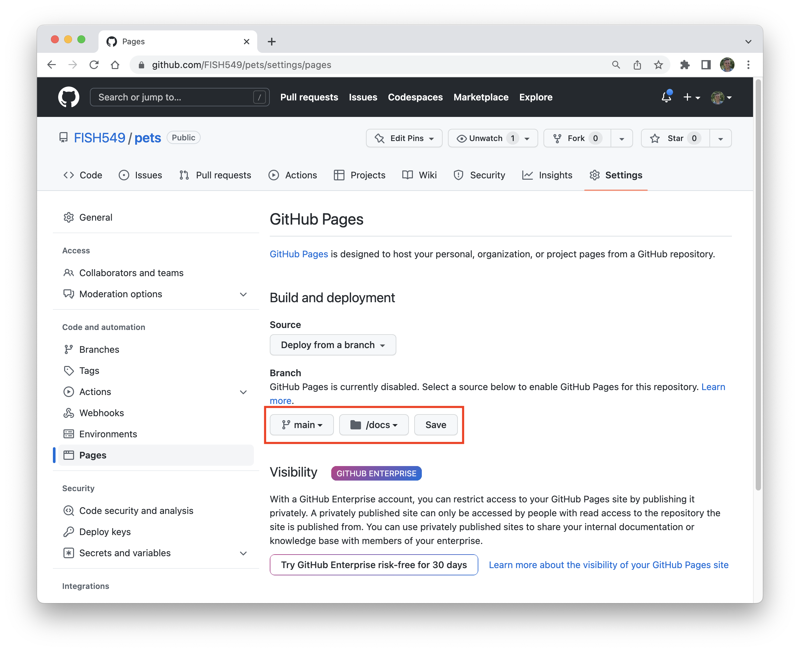

```{r set_defaults, include=FALSE}
knitr::opts_chunk$set(echo = TRUE, eval = FALSE)
```

***

# Background

We saw [last time](lec_23_packages_1.html) how to create a basic package from a simple function, document its contents, and explore its functionality. In this exercise, we'll learn how to create formal tests for our functions, write vignettes, and publish our package to the web.

***

# Testing

We spent just a bit of time testing out our `cats()` function, but we can formalize this process with so-called *unit tests*. This basically means we'll establish some expectations about what our function should return when passed certain arguments. As [Wickham & Bryan](https://r-pkgs.org/tests.html) point out, there are four advantages to working with unit tests:

1) Fewer bugs and errors;

2) More rigorous code structure;

3) Easier start/stop points;

4) Code that's robust to changes.

Fortunately, the `{devtools}` package helps us with this process via some built-in functions. To begin, we'll use `use_testthat()` to set up our framework for testing, which will

* add `Suggests: testthat` to `DESCRIPTION`;

* create the directory `tests/testthat/`; and

* add the script `tests/testthat.R`.

<div class="boxy boxy-blue boxy-clipboard-list">
**Task:** Load the `{devtools}` package.
</div>

```{r load_devtools}
> library(devtools)
Loading required package: usethis
```

<div class="boxy boxy-blue boxy-clipboard-list">
**Task:** Set the testing framework with `use_testthat()`.
</div>

```{r use_testthat}
## set testing framework
> use_testthat()
✔ Setting active project to '/Users/mark/Documents/GitHub/FISH549/pets'
✔ Adding 'testthat' to Suggests field in DESCRIPTION
✔ Setting Config/testthat/edition field in DESCRIPTION to '3'
✔ Creating 'tests/testthat/'
✔ Writing 'tests/testthat.R'
• Call `use_test()` to initialize a basic test file and open it for editing
```

## Write a unit test

Now that we have our testing framework, we need to write some actual test scripts. Here again, we see a suggestion like [last time](https://fish549.github.io/website/lectures/week_08/lec_23_packages_1.html#Write_a_function) to use `use_test()` to initialize a basic test file.

<div class="boxy boxy-blue boxy-clipboard-list">
**Task:** Use the `use_test()` function to create an empty script for testing our `cats()` function.
</div>

```{r use_test}
> use_test("cats")
✓ Writing 'tests/testthat/test-cats.R'
● Modify 'tests/testthat/test-cats.R'
```

You should now see a script called `test-cats.R` with the following example unit test in it.

```{r test_that_default}
test_that("multiplication works", {
  expect_equal(2 * 2, 4)
})
```

Unit tests are hierarchical in nature. So-called *expectations* are grouped into *tests*, which are then organized into *files*. Expectations are informal and intended solely for human eyes---they will never be read or checked by an **R** function. The test itself is embedded within `test_that()`, and is based upon the expected result of an operation that we check with an `expect_` function. In the example test shown above, the expectation is that `"multiplication works"`. The specific test of the expectation is whether or not `2 * 2 == 4`, which is coded as `expect_equal(2 * 2, 4)`. 

<div class="boxy boxy-orange boxy-lightbulb">
**Tip:** You can find a whole battery of `{testthat}` functions [here](https://testthat.r-lib.org/reference/index.html).
</div>

Let's go ahead and write some unit tests for `cats()`.

<div class="boxy boxy-blue boxy-clipboard-list">
**Task:** Delete the default unit test in `test-cats.R` and replace it with the following code.
</div>

```{r unit_test_1}
test_that("logical operators work", {
  ## if TRUE
  expect_equal(cats(TRUE), "I love cats!")
  ## if alias for TRUE
  expect_equal(cats(1), "I love cats!")
  ## if FALSE
  expect_equal(cats(FALSE), "I am not a cat person.")
  ## if alias for FALSE
  expect_equal(cats(0), "I am not a cat person.")
})
```

<div class="boxy boxy-blue boxy-clipboard-list">
**Task:** Save your file when you're done entering the tests.
</div>

## Run unit tests

Now we're set to run these tests with the `test()` function.

<div class="boxy boxy-blue boxy-clipboard-list">
**Task:** Call `test()` and note the output, which may differ somewhat from below.
</div>

```{r run_test}
> test()
ℹ Testing pets

Attaching package: ‘testthat’

The following object is masked from ‘package:devtools’:

    test_file

✔ | F W S  OK | Context
⠏ |         0 | cats                                                      
[1] "I love cats!"
[1] "I love cats!"
[1] "I am not a cat person."
[1] "I am not a cat person."
✔ |         4 | cats

══ Results ════════════════════════════════════════════════════════════════════════
[ FAIL 0 | WARN 0 | SKIP 0 | PASS 4 ]
```

What does this all mean?

The report indicates how many total tests were run (4) and the output of each test. The `Results` section at the bottom shows how many of the tests failed (`FAIL`), issued a warning (`WARN`), were skipped (`SKIP`), and passed (`PASS`).

<div class="boxy boxy-success boxy-check">
**Success:** All four of our tests passed!
</div>

<div class="boxy boxy-orange boxy-lightbulb">
**Tip:** Now is a good time to commit your changes and push them to **GitHub**.
</div>

***

# Packages on GitHub

The `pets` repo we created on **GitHub** contains our package skeleton in human-readable form. One of the neat things about this is that you (or anyone else) can now install the package directly from **GitHub**.

<div class="boxy boxy-orange boxy-lightbulb">
**Tip:** You can use either of the following function calls to install a package diectly from GitHub. To do so, replace `GITHUB_USERNAME` with the username of the repo's owner and `PACKAGE` with the package's name.
</div>

```{r install_gh}
## original call using {devtools} still works
devtools::install_github("GITHUB_USERNAME/PACKAGE")

## but {remotes} is the newer package with the function
remotes::install_github("GITHUB_USERNAME/PACKAGE")
```

<div class="boxy boxy-orange boxy-lightbulb">
**Tip:** If you try either of these commands and get the following error, run `Sys.unsetenv("GITHUB_PAT")` and then try again. 
</div>

```
Using github PAT from envvar GITHUB_PAT
Error: Failed to install 'pets' from GitHub:
  HTTP error 401.
  Bad credentials
```

## Editing the `README.md`

Because your package now lives in a public space on GitHub where others can find and use it, you should include some helpful information in the `README.md` file to describe the package contents and how it works.

<div class="boxy boxy-blue boxy-clipboard-list">
**Task:** Use the `use_readme_rmd()` function to create a **Markdown** file with a skeleton to add information about your package.
</div>

```{r use_readme}
> use_readme_rmd()
✓ Writing 'README.Rmd'
✓ Adding '^README\\.Rmd$' to '.Rbuildignore'
● Modify 'README.Rmd'
✓ Writing '.git/hooks/pre-commit'
```

The output above indicates that the function

* created `README.Rmd`

* added some lines to `.Rbuildignore`

* created a **Git** *pre-commit hook* to keep `README.Rmd` and `README.md` synced with one another

<div class="boxy boxy-blue boxy-clipboard-list">
**Task:** Open up `README.Rmd` and inspect its contents. 
</div>

At the top of `README.Rmd` you'll see a very simply YAML section with only one entry for the `output` format.

```
---
output: github_document
---
```

Below that you will see a number of sections with prompts asking for more information about the package, including a description of the package, how to install it, and example of its usage. 

<div class="boxy boxy-orange boxy-lightbulb">
**Tip:** Comments in **Markdown** are denoted by `<!-- some comment here -->`.
</div>

<div class="boxy boxy-blue boxy-clipboard-list">
**Task:** In the first section `# pets`, go ahead and enter some descriptive text about the package contents (you can delete the comments about badges).
</div>

```
# pets

The goal of pets is to provide a simple means for people to express their feelings about pets. At present, the package only contains one function: `cats()`.
```

<div class="boxy boxy-blue boxy-clipboard-list">
**Task:** In the next section on `## Installation`, add some install instructions like those shown above.
</div>

````
## Installation

You can install the development version of pets like so:

``` r
if(!require("devtools")) {
  install.packages("devtools")
}
devtools::install_github("FISH549/pets")
```
````

<div class="boxy boxy-blue boxy-clipboard-list">
**Task:** In the `## Example` section, fill in some information with example calls to `cats()`.
</div>

````
## Example

Here are two simple examples that allow you to express your feelings about cats.

`r ''````{r example}
library(pets)

## if you like cats
cats(TRUE)

## if you don't like cats
cats(FALSE)
```
````

<div class="boxy boxy-blue boxy-clipboard-list">
**Task:** When you are finished editing `README.Rmd`, knit it with the **Knit** button in **RStudio** or use the `build_readme()` function at the command line.
</div>

```{r build_ _readme}
> build_readme()
Installing pets in temporary library
Building /Users/mark/Documents/GitHub/pets/README.Rmd
```

<div class="boxy boxy-blue boxy-clipboard-list">
**Task:** Now commit **both** `README.Rmd` and `README.md` and then push them to **GitHub**. When you are finished, check out your `pets` repo on **GitHub** to see the new changes to your `README.md`.
</div>


***

# Vignettes

Vignettes offer a longer description of a package's utility. They aren't a necessary component of a package, but rather one of the "bells and whistles". Vignettes are written in **Markdown** and can be accessed via `vignette(name)` where `name` is the name of the vignette.

<div class="boxy boxy-orange boxy-lightbulb">
**Tip:** You can see a list of all of the vignettes within a particular package with `browseVignettes("packagename")`.
</div>

<div class="boxy boxy-blue boxy-clipboard-list">
**Task:** To create a vignette, use the `use_vignette()` function by passing it the name of the vignette file to create. Here use `"example-usage"`.
</div>

```{r vignette}
> use_vignette("example-usage")
✔ Adding 'knitr' to Suggests field in DESCRIPTION
✔ Setting VignetteBuilder field in DESCRIPTION to 'knitr'
✔ Adding 'inst/doc' to '.gitignore'
✔ Creating 'vignettes/'
✔ Adding '*.html', '*.R' to 'vignettes/.gitignore'
✔ Adding 'rmarkdown' to Suggests field in DESCRIPTION
✔ Writing 'vignettes/example-usage.Rmd'
• Modify 'vignettes/example-usage.Rmd'
```

The call to `use_vignette()` did the following

* added the necessary dependencies to `DESCRIPTION`

* added some folders and files to `.gitignore`

* created a `vignettes/` directory

* created the skeleton file `vignettes/example-usage.Rmd`

<div class="boxy boxy-blue boxy-clipboard-list">
**Task:** Inspect the contents of `example-usage.Rmd`. At the top you'll see the following YAML section.
</div>

```
---
title: "example-usage"
output: rmarkdown::html_vignette
vignette: >
  %\VignetteIndexEntry{example-usage}
  %\VignetteEngine{knitr::rmarkdown}
  %\VignetteEncoding{UTF-8}
---
```

<div class="boxy boxy-blue boxy-clipboard-list">
**Task:** Change the title to be a little more informative.
</div>

```
title: "Using the pets package"
```

<div class="boxy boxy-blue boxy-clipboard-list">
**Task:** Change `%\VignetteIndexEntry{example-usage}` to match our new title.
</div>

```
%\VignetteIndexEntry{Using the pets package}
```

<div class="boxy boxy-blue boxy-clipboard-list">
**Task:** Scroll down below the YAML and inspect the first code chunk where two options are being set. 
</div>

```{r, echo = TRUE}
knitr::opts_chunk$set(
  collapse = TRUE,
  comment = "#>"
)
```

<div class="boxy boxy-orange boxy-lightbulb">
**Tip:** Setting `collapse = TRUE` will if possible, collapse all the source code and output blocks from one code chunk into a single block (by default, they are written to separate blocks).
</div>

<div class="boxy boxy-orange boxy-lightbulb">
**Tip:** The `comment = "#>` determines the prefix for output from function calls. You can change this to be any character string or leave it empty.
</div>

<div class="boxy boxy-blue boxy-clipboard-list">
**Task:** Add some more details to the body of the vignette.
</div>

````
# Background

The `{pets}` package was designed to allow people to express their feelings about pets. At present, the package is rather cat-centric, in that it only contains one function: `cats()`.

# Usage

To use `{pets}`, first load the package and then call the function `cats()` with a logical/boolean argument. For example, 

`r ''````{r setup}
## load pets package
library(pets)

## if you love cats
cats(TRUE)

## if you're not a big fan of cats
cats(FALSE)
```
````

<div class="boxy boxy-blue boxy-clipboard-list">
**Task:** When you are finished, go ahead and click on the **Knit** button in **RStudio** to preview the html version of the vignette.
</div>

At this point, we've created our vignette, but we still need to build it into the package itself.

<div class="boxy boxy-blue boxy-clipboard-list">
**Task:** Use the `build_vignettes()` function to build the vignette.
</div>

```{r build_vignette}
> build_vignettes()
ℹ Installing pets in temporary library
ℹ Building vignettes for pets
--- re-building ‘example-usage.Rmd’ using rmarkdown


processing file: example-usage.Rmd
                                                                                                            
output file: example-usage.knit.md

/Applications/RStudio.app/Contents/MacOS/quarto/bin/tools/pandoc +RTS -K512m -RTS example-usage.knit.md --to html4 --from markdown+autolink_bare_uris+tex_math_single_backslash --output /Users/mark/Documents/GitHub/FISH549/pets/vignettes/example-usage.html --lua-filter /Users/mark/R_libs/rmarkdown/rmarkdown/lua/pagebreak.lua --lua-filter /Users/mark/R_libs/rmarkdown/rmarkdown/lua/latex-div.lua --embed-resources --standalone --section-divs --template /Users/mark/R_libs/rmarkdown/rmd/h/default.html --highlight-style pygments --css /Users/mark/R_libs/rmarkdown/rmarkdown/templates/html_vignette/resources/vignette.css --mathjax --variable 'mathjax-url=https://mathjax.rstudio.com/latest/MathJax.js?config=TeX-AMS-MML_HTMLorMML' --include-in-header /var/folders/w6/bgxxqxln6nxf9z0wr7fypyfw0000gn/T//Rtmppjt1Se/rmarkdown-stra66d76e727.html 

Output created: example-usage.html
--- finished re-building ‘example-usage.Rmd’

ℹ Copying vignettes
ℹ Moving example-usage.html and example-usage.R to doc/
ℹ Copying example-usage.Rmd to doc/
ℹ Building vignette index
```

<div class="boxy boxy-blue boxy-clipboard-list">
**Task:** We should now rebuild our package.
</div>

```{r rebuild}
> build()
✔  checking for file ‘/Users/mark/Documents/GitHub/FISH549/pets/DESCRIPTION’ ...
─  preparing ‘pets’:
✔  checking DESCRIPTION meta-information
─  installing the package to build vignettes
✔  creating vignettes (1.8s)
─  checking for LF line-endings in source and make files and shell scripts
─  checking for empty or unneeded directories
─  building ‘pets_0.0.0.9000.tar.gz’
   
[1] "/Users/mark/Documents/GitHub/FISH549/pets_0.0.0.9000.tar.gz"
```

<div class="boxy boxy-blue boxy-clipboard-list">
**Task:** Re-run our package checks (most of the output below has been surpressed).
</div>

```{r run_checks}
> check()
── R CMD check results ────────────────────────────── pets 0.0.0.9000 ────
Duration: 8.7s

0 errors ✓ | 0 warnings ✓ | 0 notes ✓
```

<div class="boxy boxy-success boxy-check">
**Success:** It looks like everything is in working order!
</div>

<div class="boxy boxy-blue boxy-clipboard-list">
**Task:** Go ahead and commit your changes and push them to **GitHub**.
</div>


***

# Website

If you've spent some time searching the web for information on packages, there's a good chance you've come across a specific form of package website. For example, [here](https://usethis.r-lib.org/) is the wesbite for the `{usethis}` package that we've used to build our `{pets}` package. These websites are created with the [`{pkgdown}`](https://pkgdown.r-lib.org/index.html) package, which we can use to create a website for `{pets}`.

<div class="boxy boxy-blue boxy-clipboard-list">
**Task:** Begin by loading the `{pkgdown}` package.
</div>

```{r load_pkgdown}
> library(pkgdown)

Attaching package: ‘pkgdown’

The following object is masked from ‘package:devtools’:

    build_site
```

<div class="boxy boxy-blue boxy-clipboard-list">
**Task:** Configure your package to use `{pkgdown}`.
</div>

```{r init_pkgdown}
> use_pkgdown()
✔ Adding '^_pkgdown\\.yml$', '^docs$', '^pkgdown$' to '.Rbuildignore'
✔ Adding 'docs' to '.gitignore'
✔ Writing '_pkgdown.yml'
• Modify '_pkgdown.yml'
```

`use_pkgdown()` will add a new file called `_pkgdown.yml`, which contains some YAML and fields for `url` and `template`

```
url: ~
template:
  bootstrap: 5
```

Now we can use `pkgdown::build_site()` to create the actual website for the package. When you call this function, you'll see a verbose response from **R** followed by a preview of your site opened in your web browser.

<div class="boxy boxy-red boxy-exclamation">
**Note:** Before proceeding, we need to make a small change to our `.gitignore` file. When we run `build_site()`, it creates the necessary html and supporting files in the `/docs` directory, so we need to remove it from `.gitignore` so that we can commit its contents and push the changes to **GitHub**.
</div>

<div class="boxy boxy-blue boxy-clipboard-list">
**Task:** Open your `.gitignore` file and look for `docs` (Mark's is in a block called `# R Environment Variables`). Comment it out.
</div>

```
# R Environment Variables
.Renviron
.Rproj.user
inst/doc
/doc/
/Meta/
# docs
```

<div class="boxy boxy-blue boxy-clipboard-list">
**Task:** Call `build_site()` to create the necessary html and supporting files in the `/docs` directory.
</div>

```{r build_site}
> build_site()
-- Installing package into temporary library -------------------------------------------
== Building pkgdown site =======================================================
Reading from: '/Users/mark/Documents/GitHub/FISH549/pets'
Writing to:   '/Users/mark/Documents/GitHub/FISH549/pets/docs'
-- Initialising site -----------------------------------------------------------
-- Building home ---------------------------------------------------------------
Reading 'LICENSE.md'
Writing '404.html'
-- Building function reference -------------------------------------------------
Reading 'man/cats.Rd'
Writing 'reference/cats.html'
-- Building articles -----------------------------------------------------------
Writing 'articles/index.html'
Reading 'vignettes/example-usage.Rmd'
Writing 'articles/example-usage.html'
Writing 'sitemap.xml'
-- Building search index -------------------------------------------------------
== DONE ========================================================================
-- Previewing site ---------------------------------------------------------------------
```

<div class="boxy boxy-blue boxy-clipboard-list">
**Task:** Commit your changes and push them to **GitHub**.
</div>

<div class="boxy boxy-blue boxy-clipboard-list">
**Task:** Navigate to your `pets` repo on **GitHub** and click on the **Settings** tab.
</div>

<div class="boxy boxy-blue boxy-clipboard-list">
**Task:** Under the section on the left titled **Code and automation**, click on **Pages**.
</div>

<div class="boxy boxy-blue boxy-clipboard-list">
**Task:** Under **Branch** select `main` and set the folder to `/docs`.
</div>

<div class="boxy boxy-blue boxy-clipboard-list">
**Task:** Click **Save** when you're done.
</div>



<div class="boxy boxy-blue boxy-clipboard-list">
**Task:** Navigate to `https://USERNAME.github.io/pets/` to view the website for your package (where `USERNAME` is your GitHub user name).
</div>

<div class="boxy boxy-orange boxy-lightbulb">
**Tip:** If youget a 404 error or your site doesn't display properly, wait a few minute and force-refresh your browser.
</div>


***

# Hex sticker

Let's be honest---[hex stickers](https://swag.rstudio.com/s/shop) are all the rage when it comes to **R** packages. We can make our own hex sticker for our `{pets}` package with the [`{hexSticker}`](https://github.com/GuangchuangYu/hexSticker) package. The function `sticker()` will do all of the work for us.

Here we'll include an image of a silhouette cata and dog on our sticker.

<div class="boxy boxy-blue boxy-clipboard-list">
**Task:** Download the `cat_and_dog.png` image by navigating [here](https://github.com/FISH549/website/blob/main/lectures/week_08/cat_and_dog.png) and right-clicking on the image. Choose **Save Image As...** and save it in the working directory for your `{pets}` package.
</div>

<div class="boxy boxy-blue boxy-clipboard-list">
**Task:** Load `{hexSticker}` and make the following call to `sticker()` (you can type `?sticker` to see all of the function arguments).
</div>

```{r}
> library(hexSticker)
```

```{r make_sticker}
## create sticker image
sticker("cat_and_dog.png",
        ## package name
        package = "pets",
        ## heights & widths
        p_size = 18, s_x = 0.95, s_y = 0.9, asp = 0.85,
        s_width = 0.65, s_height = 0.65, p_y = 1.6,
        ## text color
        p_color = "#4b2e83",
        ## fill color
        h_fill = "white",
        ## border color
        h_color = "#85754d",
        ## filename to save
        filename = "logo.png")
```

<div class="boxy boxy-blue boxy-clipboard-list">
**Task:** Tell **R** to use our new image with `usethis::use_logo()`.
</div>

```{r use_logo}
> usethis::use_logo("logo.png")
✓ Creating 'man/figures/'
✓ Resized 'logo.png' to 240x278
● Add logo to your README with the following html:
Warning: pkgdown config does not specify the site's url, which is optional but recommended
  # pets 
  [Copied to clipboard]
```

The last thing we need to do is edit our `README.Rmd` file to include a reference to the sticker.

<div class="boxy boxy-blue boxy-clipboard-list">
**Task:** Add the following line of code to the right of the `# pets` heading.
</div>

```
# pets 
```

<div class="boxy boxy-blue boxy-clipboard-list">
**Task:** When you are finished, click the **Knit** button in **RStudio** to preview your new readme file.
</div>

<div class="boxy boxy-blue boxy-clipboard-list">
**Task:** Lastly, we need to rebuild the website with `build_site()`.
</div>

```{r}
> build_site()
-- Installing package into temporary library -------------------------------------------
== Building pkgdown site =======================================================
Reading from: '/Users/mark/Documents/GitHub/FISH549/pets'
Writing to:   '/Users/mark/Documents/GitHub/FISH549/pets/docs'
-- Initialising site -----------------------------------------------------------
-- Building favicons -----------------------------------------------------------
Building favicons with realfavicongenerator.net...
Copying 'pkgdown/favicon/apple-touch-icon-120x120.png' to 'apple-touch-icon-120x120.png'
Copying 'pkgdown/favicon/apple-touch-icon-152x152.png' to 'apple-touch-icon-152x152.png'
Copying 'pkgdown/favicon/apple-touch-icon-180x180.png' to 'apple-touch-icon-180x180.png'
Copying 'pkgdown/favicon/apple-touch-icon-60x60.png' to 'apple-touch-icon-60x60.png'
Copying 'pkgdown/favicon/apple-touch-icon-76x76.png' to 'apple-touch-icon-76x76.png'
Copying 'pkgdown/favicon/apple-touch-icon.png' to 'apple-touch-icon.png'
Copying 'pkgdown/favicon/favicon-16x16.png' to 'favicon-16x16.png'
Copying 'pkgdown/favicon/favicon-32x32.png' to 'favicon-32x32.png'
Copying 'pkgdown/favicon/favicon.ico' to 'favicon.ico'
Copying 'logo.png' to 'logo.png'
-- Building home ---------------------------------------------------------------
Writing 'authors.html'
Reading 'LICENSE.md'
Writing 'LICENSE.html'
Writing 'LICENSE-text.html'
Copying 'man/figures/logo.png' to 'reference/figures/logo.png'
Writing '404.html'
-- Building function reference -------------------------------------------------
Writing 'reference/index.html'
Reading 'man/cats.Rd'
Writing 'reference/cats.html'
-- Building articles -----------------------------------------------------------
Writing 'articles/index.html'
Reading 'vignettes/example-usage.Rmd'
Writing 'articles/example-usage.html'
Writing 'sitemap.xml'
-- Building search index -------------------------------------------------------
== DONE ========================================================================
-- Previewing site ---------------------------------------------------------------------
```

<div class="boxy boxy-blue boxy-clipboard-list">
**Task:** When it finishes, go ahead and commit your changes and push them to **GitHub**.
</div>

<div class="boxy boxy-blue boxy-clipboard-list">
**Task:** Finally, navigate back to your `pets` repo on **GitHub** and preview your changes.
</div>
