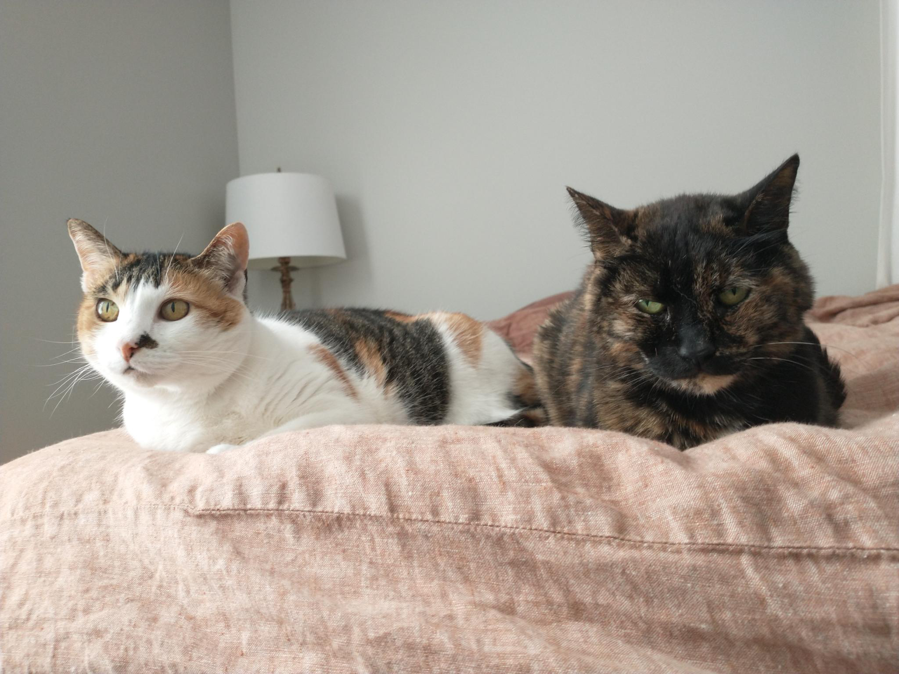
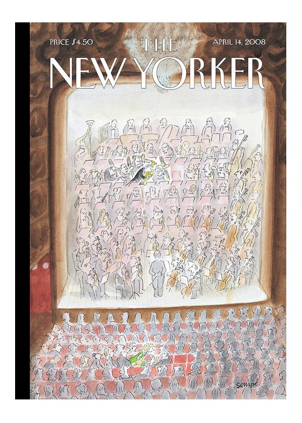
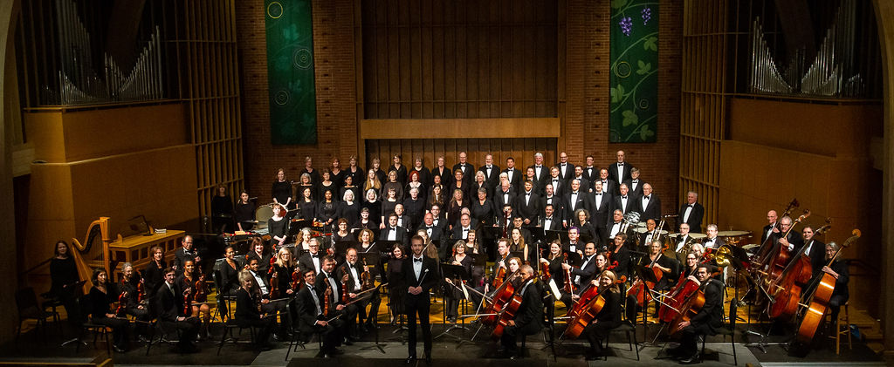
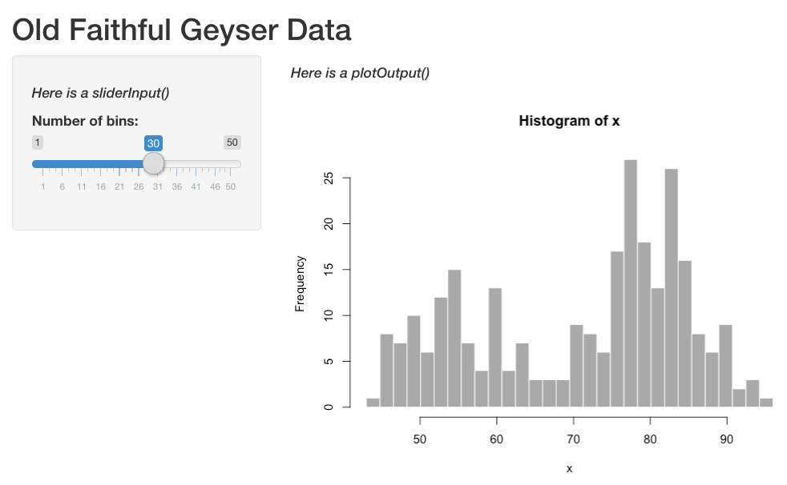
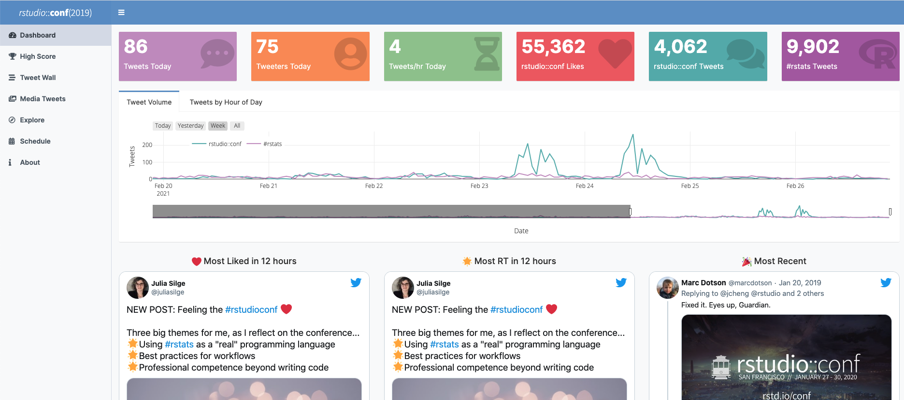

```{r xaringan-themer, include=FALSE, warning=FALSE}
library(xaringanthemer)
style_mono_accent(
  base_color = "#2a5674",
  header_font_google = google_font("Source Sans Pro"),
  text_font_google   = google_font("Source Sans Pro", "500", "500i"),
  code_font_google   = google_font("Fira Mono"),
  code_font_size = "0.7rem"
)
##d1eeea,#a8dbd9,#85c4c9,#68abb8,#4f90a6,#3b738f,#2a5674
```

class: center, middle

# Hello! 

---

# Introductions

I am Margaret Siple (I go by Megsie) and I work at NOAA Alaska Fisheries Science Center. I live in Beacon Hill with two cats, Squirrel and Molly.



---

# Introductions 

[Here](https://www.menti.com/alhsjbv7aqsq) is a brief poll so I can get to know you.


---

class: center, middle


---

# Fisheries science can be like an orchestra

Each musician has areas where they’re very specialized, and areas where they are clueless

--

What we do is a combination of highly technical skilled work and more whimsical multitasking/creativity

--

But we’re all working together to try to make a big, beautiful thing happen 

---

class: center, middle

<sub><sup>Photo: Shaya Lyon</sup></sub>

---

class: center, middle

<sub><sup>Photo: Shaya Lyon</sup></sub>

---
## How we channel complexity in an orchestra: 

### Clean it up

### Use building blocks

### Streamline our communications

### Stay aware of the big picture

--

### <mark> Many of these concepts apply to the sciences! Shiny can help us do these things *and* create something beautiful that communicates data and concepts. </mark>


---

class: center, middle

Shiny can be a little gnarly at first.


---

# Outline

1. `shiny` basics - when to use it, how to do it

--

2. Some features you can use to improve functionality

  User uploads & downloads

  Making dashboards with `{flexdashboard}`
  
--

3. Lessons I learned from developing "mmBIET"

--

If you'd like to follow along, clone this directory and follow the examples!
[https://github.com/mcsiple/shinyoverview](https://github.com/mcsiple/shinyoverview)

--

There are many other things available in the repo that we won't cover today, but examples are included so you can try them on your own:

> 4. *Translating your Shiny apps using `{shiny.18n}`*

> 5. *Using Shiny to supercharge your remote teaching with `{learnr}`*

> 6. *Generating Markdown reports from Shiny*

---

# Why I learned Shiny


.caption[
**Image:** Jeff Moore
]

---

# Why I learned Shiny


---

# What is Shiny?


---

# When is Shiny useful?

When we want to make R code accessible outside of an R or RStudio environment. For example,

--

- teaching a package

--

- streamlining certain code-intensive activities (like summarizing and communicating simulation outputs)

--

- giving non-experts a way to "get to know" models and data

---

# Starting a new Shiny app

Install **shiny**:

```{r eval=FALSE, tidy=FALSE}
install.packages("shiny")
```

From The RStudio IDE, pick `New File -> Shiny Web App`

You can choose between single (**app.R**) or multiple files (**ui.R** and **server.R**)

*Does it matter which one you choose?*
>Not really. Some like the organization of having multiple files `r emoji::emoji("shrug")`


---

# Each Shiny app has two components

.pull-left[
The **`ui`** (user interface) object dictates the appearance of the app. UI functions write HTML. For something to appear in your app, it needs to be in the UI.
]

.pull-right[
The **`server()`** function contains rendering expressions that create the objects to display. 

The server function and UI object are passed to the `shinyApp()` function to create a Shiny app object.
]


---

# **ui.R**/server.R

.pull-left[
The ui looks like this (the "interactive" part is highlighted):


```{r eval=FALSE}
ui <- fluidPage(
    titlePanel("Old Faithful Geyser Data"),
    sidebarLayout(
        sidebarPanel(
*            sliderInput("bins",
                        "Number of bins:",
                        min = 1,
                        max = 50,
                        value = 30)),
        mainPanel(
           plotOutput("distPlot"))
    )
)
```
]

.pull-right[
The corresponding ui looks like this:


]

---

# **ui.R**/server.R

The ui code contains the following information: 

1. The UI type 
  - `fluidPage()` puts elements in rows that can include columns `r emoji::emoji("cake")`
  - `navbarPage()` has a navigation bar `r emoji::emoji("file")`

2. Layout elements (`sidebarLayout()` etc.)

3. Theme information (e.g., `{shinythemes}`)

--

4. Output objects (`plotOutput()`, etc.)

5. Input objects (`sliderInput()`,`fileInput()` etc.) - also called "widgets"

*Input objects link the UI to R code that runs on the server.*

<!-- devtools::install_github("hadley/emo") -->
---

# ui.R/**server.R**

The server builds a list-like object called `output`. The contents of `output` are displayed in the ui.

```{r eval= FALSE}
server <- function(input, output) {
    output$distPlot <- renderPlot({
        # generate bins based on input$bins from ui.R
        x    <- faithful[, 2]
        bins <- seq(min(x), max(x), length.out = input$bins + 1)
        # draw the histogram with the specified number of bins
        hist(x, breaks = bins, col = 'darkgray', border = 'white')
    })
}
```

---

# **ui.R**/**server.R**

The server builds a list-like object called `output`. `output` objects are displayed in the ui. Here is how they are linked:

.pull-left[
```{r eval= FALSE}
server <- function(input, output) {
*    output$distPlot <- renderPlot({
        # generate bins based on input$bins from ui.R
        x    <- faithful[, 2]
        bins <- seq(min(x), max(x), length.out = input$bins + 1)
        # draw the histogram with the specified number of bins
        hist(x, breaks = bins, col = 'darkgray', border = 'white')
    })
}
```
]

.pull-right[
```{r eval=FALSE}
ui <- fluidPage(
    titlePanel("Old Faithful Geyser Data"),
    sidebarLayout(
        sidebarPanel(
            sliderInput("bins",
                        "Number of bins:",
                        min = 1,
                        max = 50,
                        value = 30)),
        mainPanel(
*           plotOutput("distPlot"))
    )
)
```
]
---

# What's on the server?

R code... mostly :)

--


---

# ui.R/**server.R**

- **Rendering functions** (`renderPlot()`, `renderTable()`, etc.)
  - Build a new object to display every time the inputs change

--

- **Reactive expressions** are "lazy" - they don't execute unless they are specifically called to do something. 
  - `reactive()` caches reactive objects so you can access them later in the server logic -- very important!
  - `eventReactive()` creates reactive objects but only when a specific input changes (e.g., a "Fit this model!" button is clicked)

--

- **Observe expressions** are "eager" - they automatically execute when their dependencies change. Expressions like `observe()` can:
  - autopopulate default values in a form
  - change the range for one input based on another input

---

class: center, middle

# 01_basics/app.R

---

# Shiny dashboards

Show a dataset several ways in one place (and automatically update it!)
Use it for:

- communicating data in a polished way

- offering access to visualizations from a database

- showing a "data story" in a tailored way



---

class: center, middle

# 06_flexdashboard/app.R

---

class: center, middle

# Lessons I learned from developing a Shiny app


---

# UI is worth your time

Shiny defaults are not the most intuitive / appealing / accessible version they can be.

--

If you are designing an app for management, a good UI is essential.

--

- my #1 tip: if you have time, pilot test with subject matter experts AND users

--

- use UX resources if they are available!

--
  
- if your institution doesn't have UX resources, design pilot testing so that you get helpful feedback on UX:
  - [18F Methods](https://methods.18f.gov/validate/) and [Maze](https://maze.design/guides/usability-testing/questions/) have great lists of testing questions and methods
  - 18F Methods also has an [example agreement](https://methods.18f.gov/participant-agreement/) for testers
  - Depending on the final format, places like  [UsabilityHub](https://usabilityhub.com/) have interfaces that will provide data on clicks and scrolling behavior when testing is remote
  - Check accessibility using the app's URL using the [Web Accessibility Evaluation (WAVE) Tool](https://wave.webaim.org/)

.content-box-blue[UX = user experience.]

---

# Quick poll

What material would you like to cover on Wednesday? 
Poll [here](https://www.menti.com/alhsjbv7aqsq)

---

class: center, middle

# Fin!

### contact

`r emoji::emoji("email")`: margaret.siple@noaa.gov
`r emoji::emoji("bird")`: @margaretsiple

#### **More Shiny resources:**

[Mastering Shiny](https://mastering-shiny.org/) by Hadley Thee Wickham 

Colin Fay has several [talks](https://colinfay.me/talks-publications/) on Shiny app workflow and production

We love a [cheatsheet](https://shiny.rstudio.com/images/shiny-cheatsheet.pdf)


#### Today's code treat `r emoji::emoji("food")`

Put emoji in your GitHub commits by using the `::` syntax, e.g., 
`git commit -m this code is still growing :seedling:`
Emoji options at [gitmoji.dev](https://gitmoji.dev/)


***

Slides created using the R package [**xaringan**](https://github.com/yihui/xaringan).
