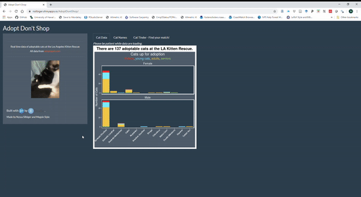

```{r xaringan-themer, include=FALSE, warning=FALSE}
library(xaringanthemer)
style_mono_accent(
  base_color = "#2a5674",
  header_font_google = google_font("Source Sans Pro"),
  text_font_google   = google_font("Source Sans Pro", "500", "500i"),
  code_font_google   = google_font("Fira Mono"),
  code_font_size = "0.7rem"
)
```

# On Monday we talked about

- Shiny: what is it good for?

- How to build a basic Shiny app


---

# Today (Wednesday) we will cover

- Getting data in and out of Shiny - so many options!

- Building cool/interactive maps using `{leaflet}`

--

- ...and then we'll just gaze at some great apps

- [here](https://github.com/mcsiple/shinyoverview) is a link to the code examples for today 


---

class: center, middle, inverse

# Getting data into and out of Shiny

---


# Get data into a Shiny app

Shiny can accept data from many file types. 

- a file the user uploads
- a database
- a persistent file packaged with your app

---

# User uploads data
If you want to design your app so that people can bring in their own data:

Add a file upload input in the UI using the function `fileInput()`. In the `server` function, access the uploaded files via `input$mydata`:
```{r eval=FALSE}
ui <- fluidPage(
  titlePanel("Uploading Files"),
  sidebarLayout(
    sidebarPanel(
      # refer to input$mydata in the server code to reference this object:
      fileInput("mydata", "Choose CSV File",
                multiple = FALSE,
                accept = c("text/csv",
                         "text/comma-separated-values,text/plain",
                         ".csv")),
```

---

# Put the data on the server

You can host small data files on the server with your app. These data can be loaded at the top of the app file (if server and ui are both located in **app.R**) or in the **ui.R** file if you're using separate files for ui and server.  

---

# More on data storage in Shiny

Dean Attali's [Persistent Data Storage With Shiny](https://daattali.com/shiny/persistent-data-storage/) app 

[This](https://shiny.rstudio.com/articles/persistent-data-storage.html) blog post about data storage in Shiny (also by Dean Attali)

RStudio's [best practices for dashboards](https://db.rstudio.com/best-practices/dashboards/) shows how to connect a `shinydashboard` to a database

---

# Getting data out of Shiny

You can download data from a Shiny app using `downloadLink()` or `downloadButton()` in the ui and `downloadHandler()` in the server:

```{r eval=FALSE}
ui <- fluidPage(
  downloadLink("downloadData", "Download")
)
server <- function(input, output) {
  # Our dataset
  data <- mtcars
  output$downloadData <- downloadHandler(
    filename = function() {
      paste("data-", Sys.Date(), ".csv", sep="")
    },
    content = function(file) {
      write.csv(data, file)
    }
  )
}
```

---

# Getting data out of Shiny

- Download **CSV or txt files** from Shiny apps

--

- Generate reports in Markdown that are knitted to **html** (details on how to do that [here](https://shiny.rstudio.com/articles/generating-reports.html))

--

- You can also download **images** that have been generated in the app (e.g., download plots generated in the app)


---

class: center, middle, inverse

# 02_dataindataout/explore_ram/ui.R


---

# Maps in Shiny with `leaflet`

Leaflet is an open-source JavaScript library that makes interactive maps.

It's *very cool*! And the `leaflet` R package integrates well with Markdown files and Shiny apps so you can show spatial data.

It gets fancy very fast. [Here](https://rstudio.github.io/leaflet/) is the guide for using `leaflet` in R and integrating it with Shiny.

---

class: center, middle, inverse

# 0n_maps/app.R


---

class: center, middle, inverse

# Some cool Shiny apps


---

# Some cool Shiny apps

A cool example of how to use Shiny instead of a lengthy paper appendix to illustrate a point: [Beyond Temperature](https://heatherwelch.shinyapps.io/beyond_temperature/) by Jennifer McHenry, Heather Welch, Sarah E. Lester, and Vincent Saba

A use of Shiny to aggregate useful stuff (and it uses an API!): [tidytuesday.rocks](https://nsgrantham.shinyapps.io/tidytuesdayrocks/) by Neal Grantham

Use Shiny to provide effective data viz on large datasets: [Sentify](https://rcharlie.shinyapps.io/sentify/) by Charlie Thompson

A whole gallery of great apps, complete with source code (and a great way to get recognized for your Shiny work!) All the submissions are [here](https://community.rstudio.com/c/shiny/shiny-contest/30) and the winners from the last contest (2021) are [here](https://posit.co/blog/winners-of-the-3rd-annual-shiny-contest/).

---

class: center, middle



---

class: center, middle


---

class: center, middle

# Fin

#### Today's code treat `r emo::ji("pastry")`

`Ctl-P` shortcut jumps to the close parentheses of the statement you're in. Extremely useful for Shiny. 

`r emo::ji("rain")` You can also enable rainbow parentheses in Global Options by going to `Code --> Display--> Rainbow parentheses`

#### contact
`r emo::ji("email")`: margaret.siple@noaa.gov

If you're developing a Shiny app for a project, would love to help you! Send me questions, issues, use code from the `shinyoverview` repo, whatevas.

#### For Friday!
Eli Holmes will introduce Scrum and how to do a Scrum Sprint with GitHub Project pages and GitHub issues.  To prepare, you can watch [**this**](https://www.youtube.com/watch?v=sLK3EHPCw14) ~5-min video on scrum style workflows.


***

Slides created using the R package [**xaringan**](https://github.com/yihui/xaringan).

---

class: center, middle

# Extra slides (deployment & getting credit for your Shiny dev work)

---

# Deploying your Shiny app

## Deploy to the cloud
- Sign up for a free shinyapps.io account

- Install `{rsconnect}` 

- Configure `rsconnect` to use your account using a token from your shinyapps.io account:


---

# Deploying your Shiny app

## Deploy to the cloud
- If you add a new token and click 'show', you'll get instructions for how to configure `rsconnect` 

- Configure your rsconnect installation. This will link your shinyapps.io account to your local environment:

```{r eval=FALSE}
library(rsconnect)
setAccountInfo(name="<ACCOUNT>", token="<TOKEN>", secret="<SECRET>")`
```

- You can deploy from within RStudio by clicking the 'Publish' button in the RStudio IDE, or use the console:

```{r eval=FALSE}
deployApp(server = "shinyapps.io")`
```

- woo!

---

# Deploying your Shiny app 2

## Other options for deployment

- Deploy to an RStudio Connect account (local, commercial option)

- Publish on Shiny Server (local, open source)

---

# Getting credit for your Shiny development

If you've put a lot of time into making a Shiny app, you should get credit! 
The publication/credit avenues are unconventional for Shiny apps, but they DO exist.

- Publish as a package in an open source software journal (e.g., [JOSS](https://joss.theoj.org/) ) (check out the `{golem}` pkg for structuring your files and streamlining production) `r emo::ji("package")`

- Publish code straight from GitHub with a DOI from Zenodo ( [here](https://www.rinproduction.com/en/posts/005-8-tips-for-a-production-ready-shiny-application/) are some good tips for preparing your app for production )

- (for "just for fun" apps): submit your Shiny app to the RStudio [Shiny contest](https://community.rstudio.com/t/shiny-contest-2020-is-here/51002)
<!-- see if you can get some data on citation rates for JOSS vs zenodo github entry -->

---
