```{r set_defaults, include=FALSE}
knitr::opts_chunk$set(echo = TRUE)
```

***

# Background

One of the great features of **R Markdown** is using it to create presentations. Most of the resulting outputs are `.html` documents, but there are options to produce `.pptx` or `pdf` versions as well. One of the advantages of using one of these options is that you can easily include **R** code block and their output in the slides themselves without the need to copy and paste the information from elsewhere. Another is that you can add nicely formatted equations using the same **LaTeX** commands we saw when publishing documents to PDF formats. Although the basic options for slide formatting are somewhat limited, you can expand upon them by using [**Cascading Style Sheets (CSS)**](https://en.wikipedia.org/wiki/CSS), and there is a growing array of choices from developers available online.

## Rationale

Some people are turned off by the notion of creating presentations by writing a mix of codes and text rather than point-and-click-and-drag-and-etc. I would encourage those folks to consider the following with respect to openness and accessibility.

* Not everyone can afford or has ready access to proprietary software. Creating presentations in `.html` format means anyone with a web browser can view them.

* Nearly everyone writes code to produce the figures they ultimately include on slides---why not combine those tasks into one?

***

# Default options

**RStudio** has several forms of presentation documents available with the default options. These are

* **ioslides**: HTML presentation viewable in any web browser; slides can be printed to PDF (this is the format that Mark uses for some of the lecture material);

* **Slidy**: HTML presentation viewable in any web browser; slides can be printed to PDF;

* **Beamer**: Older form of PDF output that requires an installation of (La)TeX;

* **Powerpoint**: Slimmed down Powerpoint presentation.

<div class="boxy boxy-red boxy-exclamation">
**Note:** There are several other formats available via other packages (eg, Mark uses [Xaringan](https://bookdown.org/yihui/rmarkdown/xaringan.html)).
</div>

<div class="boxy boxy-orange boxy-lightbulb">
**Tip:** To create a presentation in **RStudio** using one of the four basic options, from the main menu select **File > New File > R Markdown...** and then click on the **Presentation** tab on the left side.
</div>

<br>

```{r rs_options, echo = FALSE, out.width = "70%", fig.align = "center"}
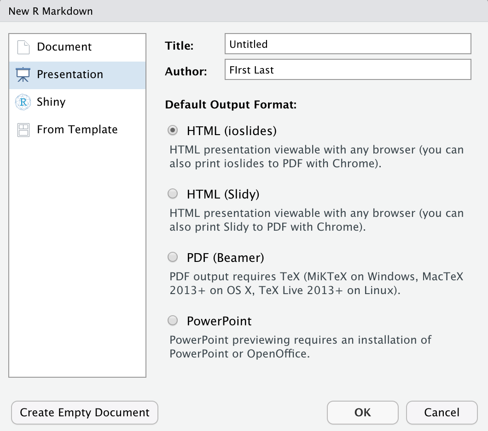
```

<br>

<div class="boxy boxy-blue boxy-clipboard-list">
**Task:** In the dialogue box, enter a title for your presentation and your name (you can also change these later). Choose the presentation format you'd like and click **OK**.
</div>

***

# ioslides

Both of the default HTML formats generally use the same options for slide layouts and styling. Here are some of the options for a basic **ioslides** presentation, which is what Mark uses for slide decks in class.

### Title slide

The content on the title slide will be drawn from the YAML in the `.Rmd` file. For example, this YAML

````markdown
---
title: "My very first presentation using ioslides"
subtitle: "FISH 549"
author: "First Last"
date: "15 February 2023"
output: ioslides_presentation
---
````

will result in this title page:

<br>

```{r ioslides_title, echo = FALSE, out.width = "80%", fig.align = "center"}
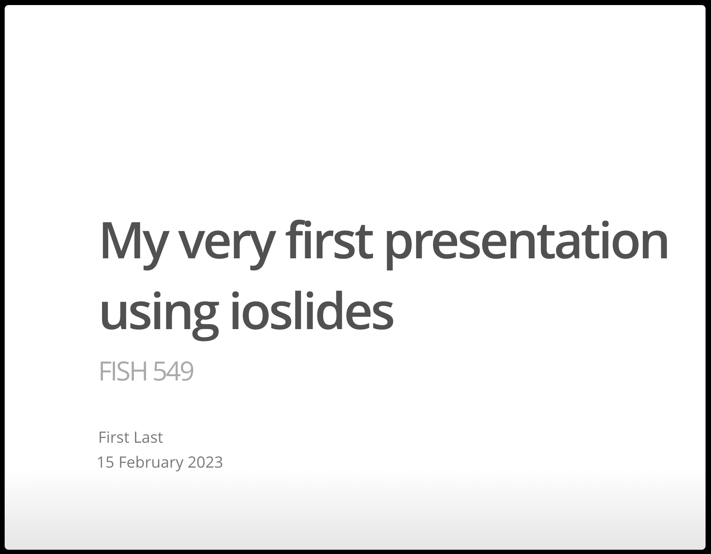
```

<br>

<div class="boxy boxy-orange boxy-lightbulb">
**Tip:** You can include line breaks in any of the elements on the title slide by inserting the HTML code `<br>` between words or phrases. 
</div>

For example, this YAML

````markdown
---
title: "My very first presentation using ioslides"
subtitle: "FISH 549"
author: "First Last<br>School of Aquatic and Fishery Sciences<br>University of Washington"
date: "15 February 2023"
output: ioslides_presentation
---
````

will result in this title page:

<br>

```{r ioslides_title_2, echo = FALSE, out.width = "80%", fig.align = "center"}
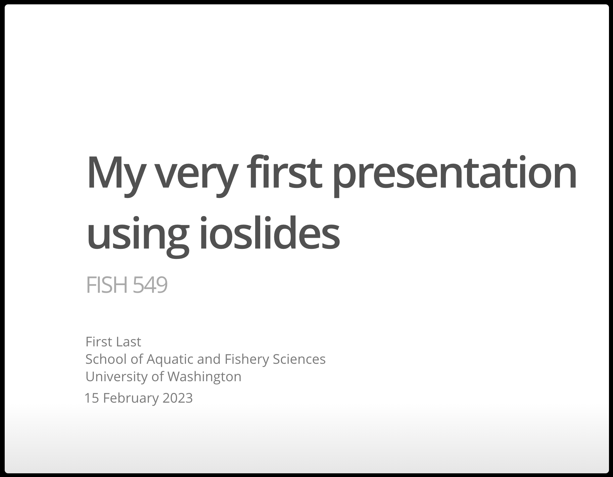
```

<br>

### Section breaks

You can specify major sections in an **ioslides** presentation with a single hastag `#`. For example, this code

````markdown
# Introduction
````

will result in a slide with this section break:

<br>

```{r ioslides_section, echo = FALSE, out.width = "80%", fig.align = "center"}
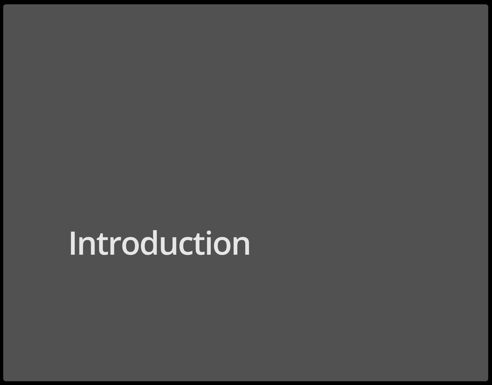
```

<br>

### Normal slide

Regular slides are given a title with 2 hashtags `##` and an optional subtitle with a pipe `|` following the title. You can then use regular **Markdown** constructs for things like (un)ordered lists. Indenting text with 4 or more spaces will create a sublist.

For example, the following code

````markdown
## R Markdown | Worship

- Such an amazing tool  
- The possibilities seem endless

    1) publishing  
    2) presentations  
    3) Shiny apps  
    4) websites
````

will result in this slide layout

<br>

```{r ioslides_regular, echo = FALSE, out.width = "80%", fig.align = "center"}
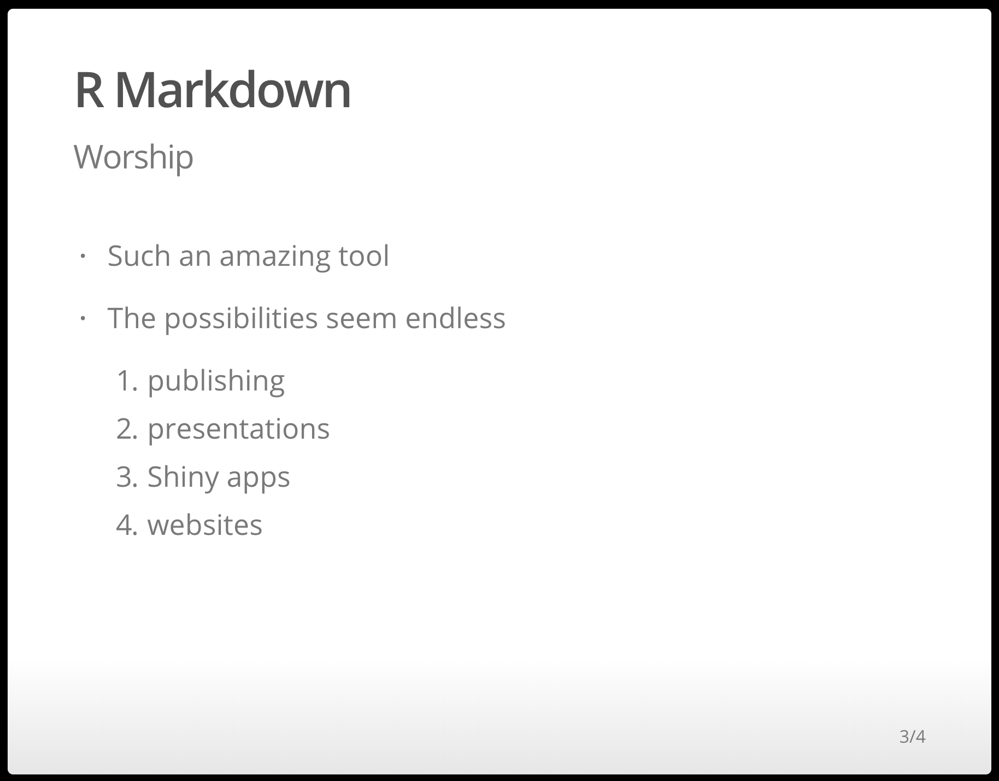
```

<br>

### Incremental bullets

You can have your bullet points appear incrementally with 3 different options. 

1) If you want all of the slides in your presentation to build incrementally, then change the YAML to this:

````markdown
output:
  ioslides_presentation:
    incremental: true
````

If you prefer that only some of the slides build incrementally, then you can either

2) include the option `{.build}` after the title of your slide, or

````markdown
## Slide title {.build}

* Something here

* Another point to make
````

3) precede an asterisk/bullet with the `>` symbol (the same one we use for blockquotes).

````markdown
## Slide title

> * Something here

> * Another point to make
````

### No slide title

You can omit the title on a slide by using three dashes `---` to demark the slide's beginning.

For example, this code 

````markdown
---

Some content without a title
````

will result in this slide layout

<br>

```{r ioslides_notitle, echo = FALSE, out.width = "80%", fig.align = "center"}
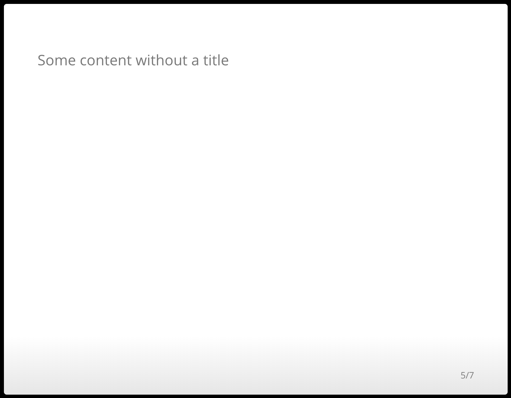
```

<br>

### Adding code blocks

You can include an **R** code block just as you would in a normal **Markdown** document. For example, this code

````markdown
## Adding code

`r ''````{r simple_code, echo = TRUE}
a <- 1
b <- 2
a / b
```
````

will result in this slide layout

<br>

```{r ioslides_code_1, echo = FALSE, out.width = "80%", fig.align = "center"}
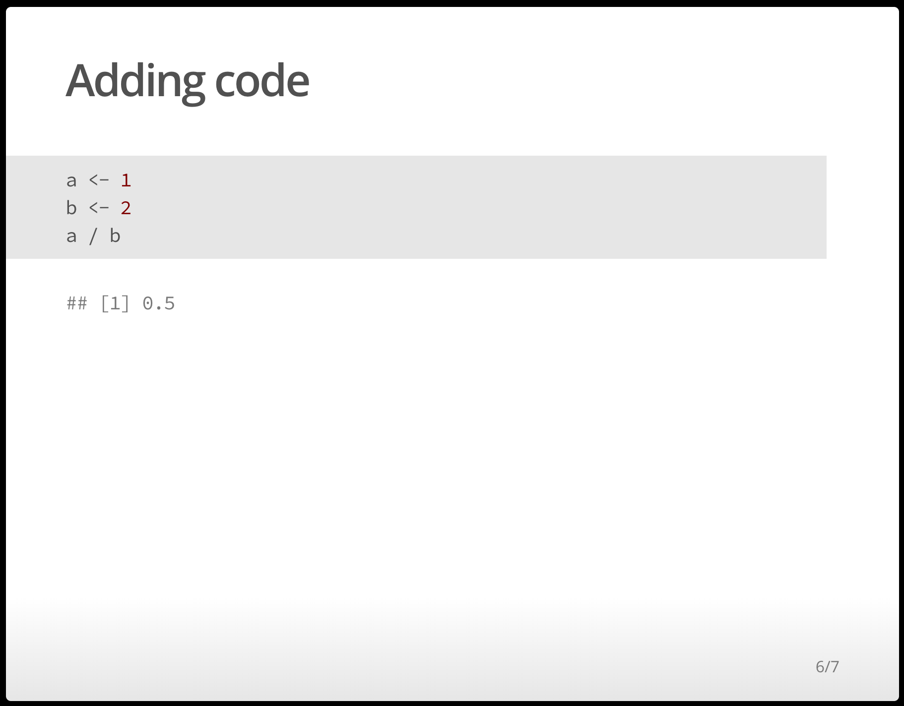
```

<br>

You can hide the code itself and only show the result with the chunk option `echo = FALSE`.

````markdown
## Adding hidden code

`r ''````{r simple_code_2, echo = FALSE}
a <- 1
b <- 2
a / b
```
````

will result in this slide layout

<br>

```{r ioslides_code_2, echo = FALSE, out.width = "80%", fig.align = "center"}
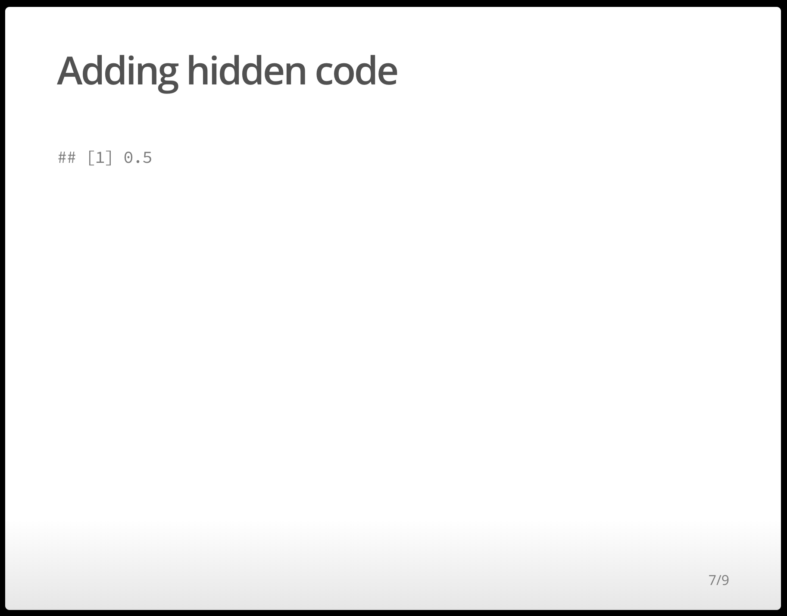
```

<br>

You can show code, but not evaluate it with the chunk option `eval = FALSE`.

````markdown
## Adding code that doesn't evaluate

`r ''````{r simple_code_3, echo = TRUE, eval = FALSE}
a <- 1
b <- 2
a / b
```
````

will result in this slide layout

<br>

```{r ioslides_code_3, echo = FALSE, out.width = "80%", fig.align = "center"}
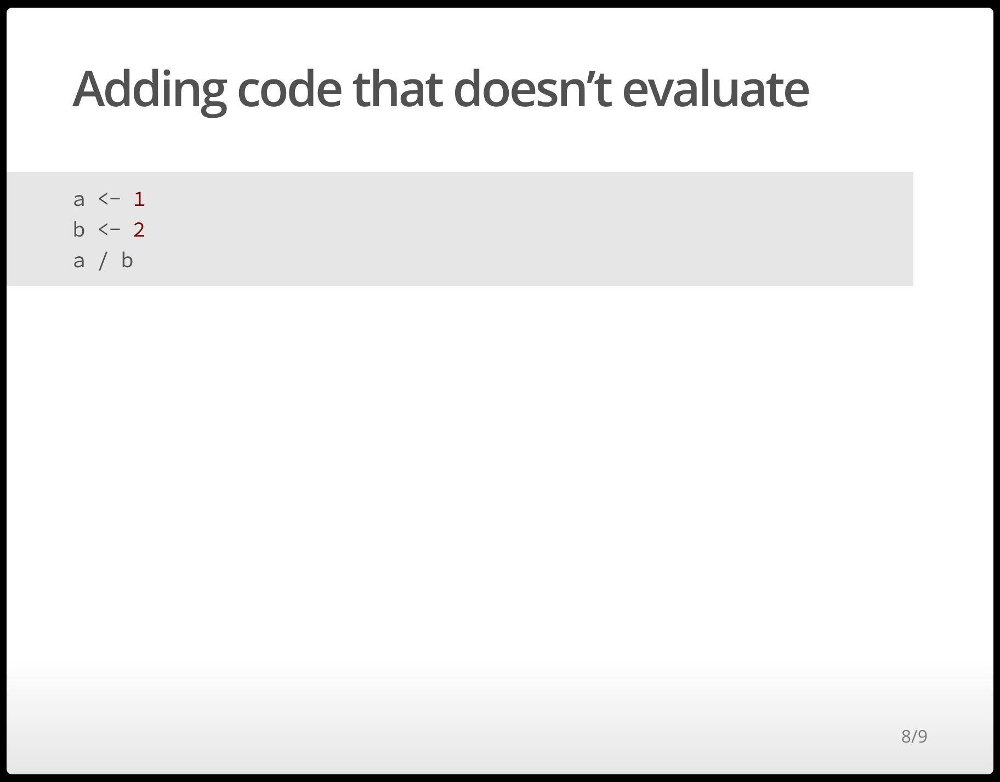
```

<br>

You can highlight certain lines of code by bracketing it with 3 hashtags `###` and the HTML codes for bold `<b> </b>`. For example,

````markdown
## Highlighting code

The third line of code appears in bold

Press `h` to make the non-bold lines fade away

`r ''````{r simple_code_4, echo = TRUE, eval = FALSE}
a <- 1
b <- 2
### <b>
a / b
### </b>
```
````

will result in this slide layout

<br>

```{r ioslides_code_4a, echo = FALSE, out.width = "80%", fig.align = "center"}
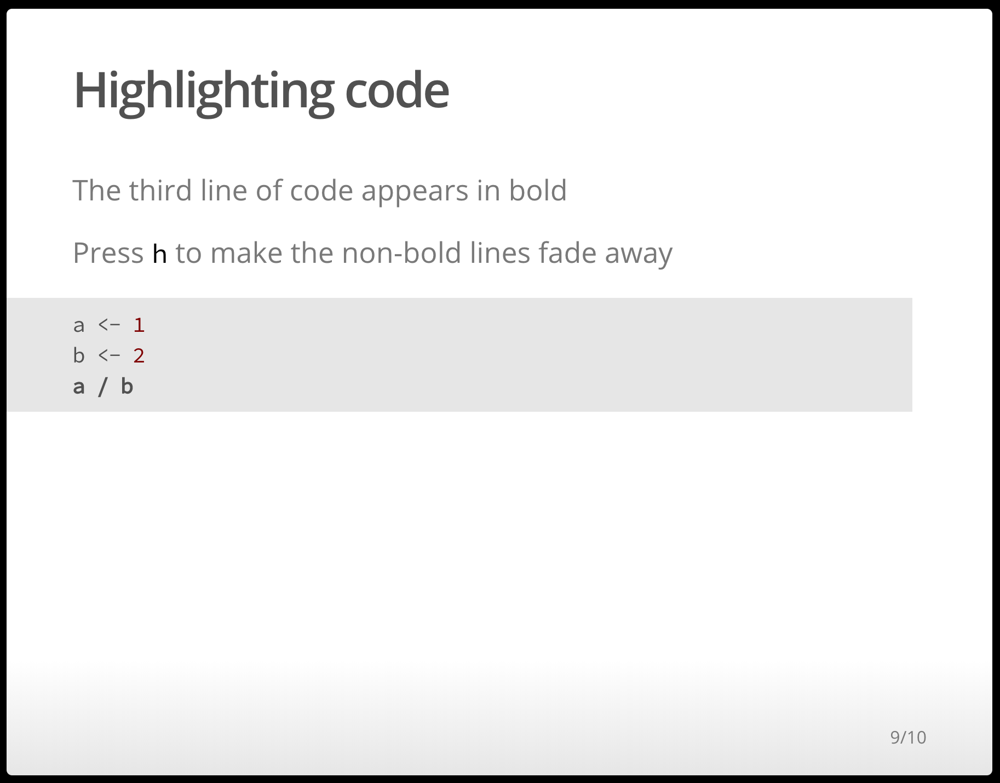
```

<br>

and when you press `h` you get this

<br>

```{r ioslides_code_4b, echo = FALSE, out.width = "80%", fig.align = "center"}
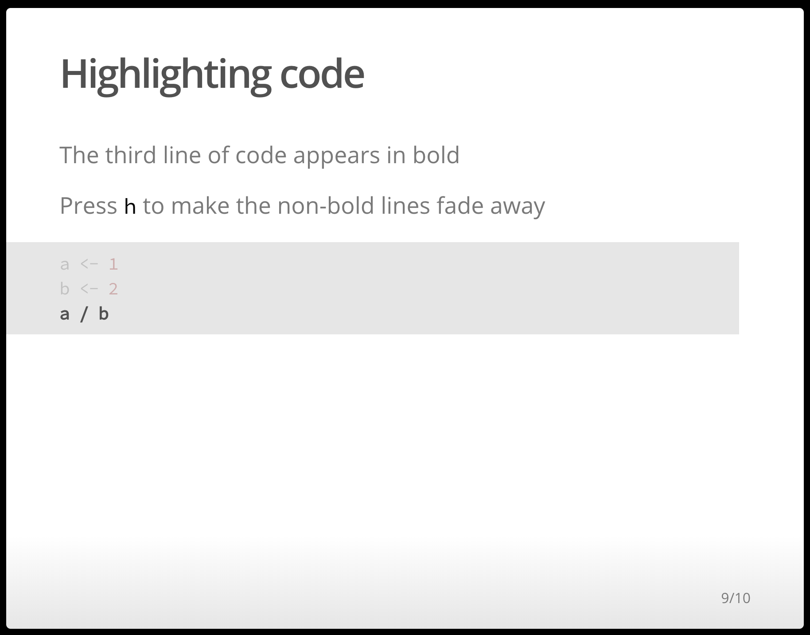
```

<br>

## Code for plotting

You can also include **R** plots in your slides with any of the various plotting commands. For example, this code will add a simple scatterplot with a caption.

````markdown
## Adding plots

`r ''````{r plot_cars, fig.cap = "A simple scatterplot", echo = FALSE}
plot(cars)
```
````

<br>

```{r ioslides_plot, echo = FALSE, out.width = "80%", fig.align = "center"}
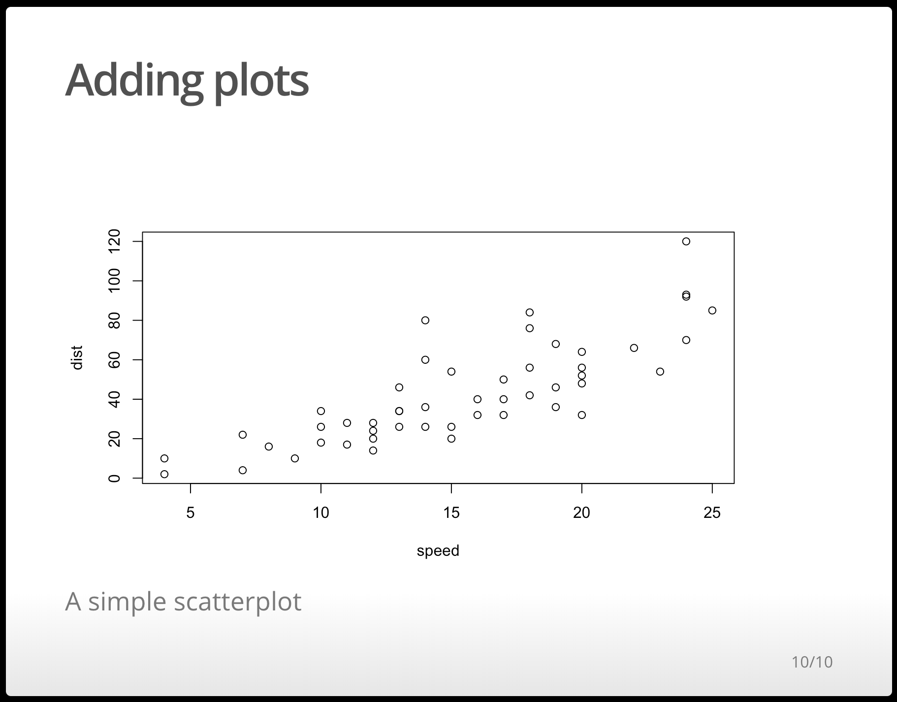
```

<br>

By default, plots are left aligned on the slide. You can center them, and resize them with some additional options in the code block. For example, this code will center the figure and make it 3" tall by 5" wide.

````markdown
## Adding plots

`r ''````{r plot_cars_2, fig.cap = "A simple scatterplot", echo = FALSE, fig.align = "center", fig.height = 3, fig.width = 5}
plot(cars)
```
````

<br>

```{r ioslides_plot_2, echo = FALSE, out.width = "80%", fig.align = "center"}
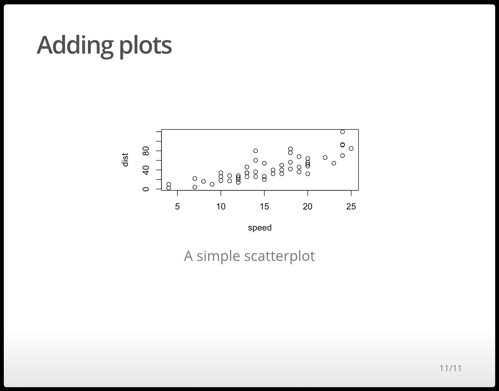
```

<br>

## Adding equations

You can add **LaTeX** equations to slides in one of two ways: standalone or inline. Standalone equations are denoted with double dollar signs (`$$`) on separate lines and inline equations are denoted by single dollar signs (`$`) on each side of the equation. For example, the following code

````markdown
## Adding equations

A standalone equation

$$
y_i = \alpha + \beta x_i + \epsilon_i
$$

An inline equation where $\epsilon_i \sim \text{N}(0, \sigma^2)$
````

would create this slide

<br>

```{r ioslides_eqns, echo = FALSE, out.width = "80%", fig.align = "center"}
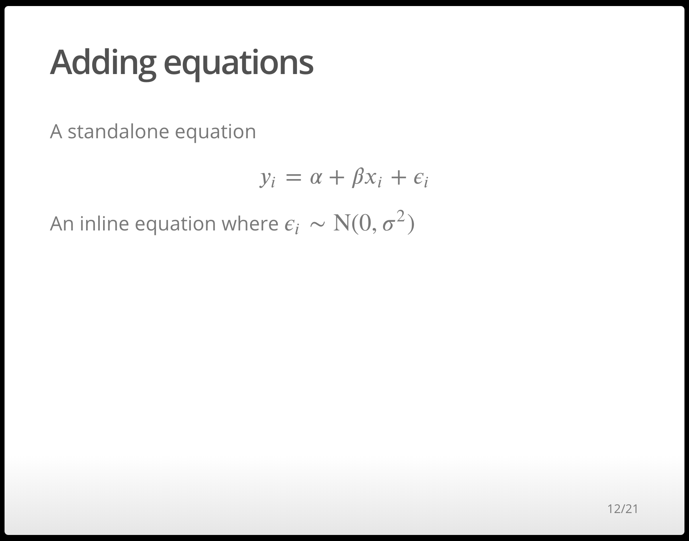
```

<br>


## Background image

You can include a background image on a slide using `data-background` and other possible attributes including `data-background-size` and `data-background-position`. For example, this code will create an untitled slide with an image that covers the entire slide. (Note the this image is in a folder called `img` located inside the folder/directory where the `.Rmd` file is located.)

````markdown
## {data-background=img/rmarkdown.png data-background-size=cover}
````

<br>

```{r ioslides_image_1, echo = FALSE, out.width = "80%", fig.align = "center"}
knitr::include_graphics("img/rmarkdown.png")
```

<br>

The following code will create a titled slide with a background image that is

* 50% the size of the original

* left-aligned

* in the middle of the slide from top to bottom

````markdown
## A smaller, off-centered image {data-background=img/rmarkdown.png data-background-size="50%" data-background-position="0% 50%"}
````

<br>

```{r ioslides_image_2, echo = FALSE, out.width = "80%", fig.align = "center"}
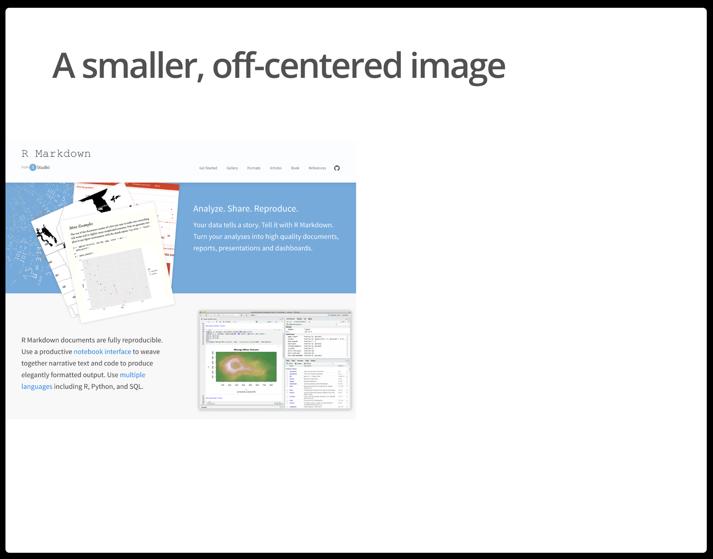
```

<br>

## Visual appearance

You can display the presentation using a wider form with the `widescreen` option in the YAML. You can also specify that smaller text be used with the `smaller` option.

```
---
title: "My very first presentation using ioslides"
subtitle: "FISH 549"
author: "First Last"
date: "15 February 2023"
output:
  ioslides_presentation:
    widescreen: true
    smaller: true
---
```

<div class="boxy boxy-orange boxy-lightbulb">
**Tip:** If you only want the text to appear smaller on some of your slides, you can add the `{.smaller}` tag to the slide header. This can be particularly nice for large code blocks.
</div>

For example, 

````markdown
## Smaller code block {.smaller}

`r ''````{r small_code, echo = TRUE}
## a simple regression model
fit <- lm(dist ~ speed, data = cars)
## model summary
summary(fit)
```
````

<br>

```{r ioslides_smallcode, echo = FALSE, out.width = "80%", fig.align = "center"}
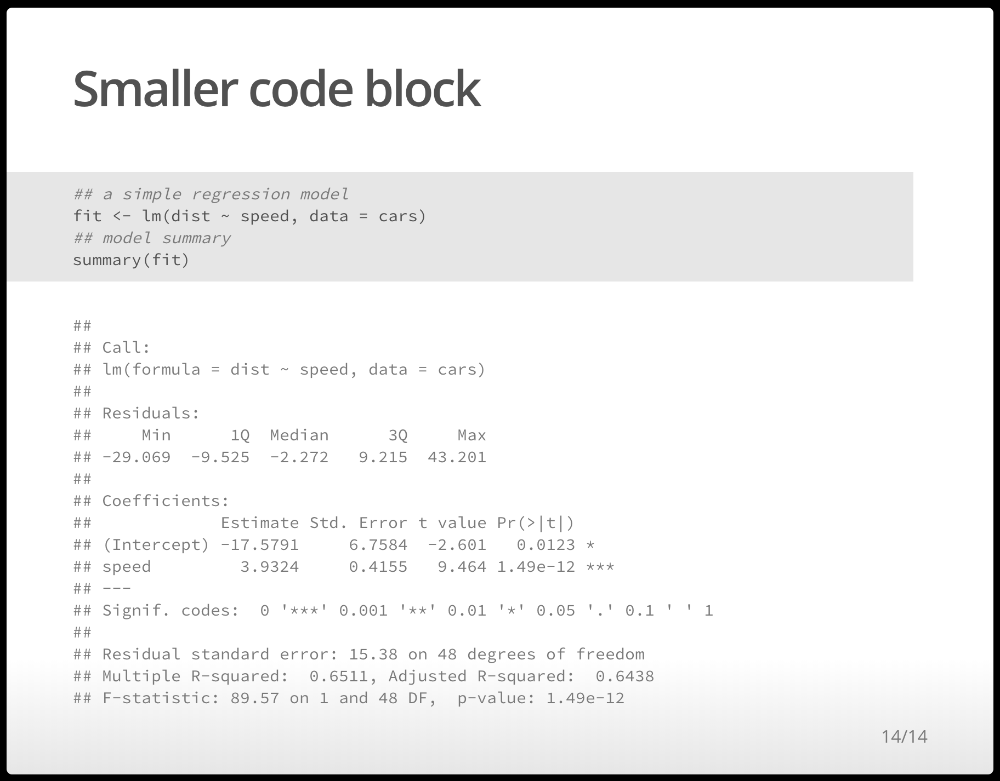
```

<br>

## Other layouts

You can center content in the middle of a slide by adding the `{.flexbox}` and `{.vcenter}` attributes to the slide title. For example:

````markdown
## {.flexbox .vcenter}

### Some centered content
````

will create a slide that looks like this:

<br>

```{r ioslides_centered, echo = FALSE, out.width = "80%", fig.align = "center"}
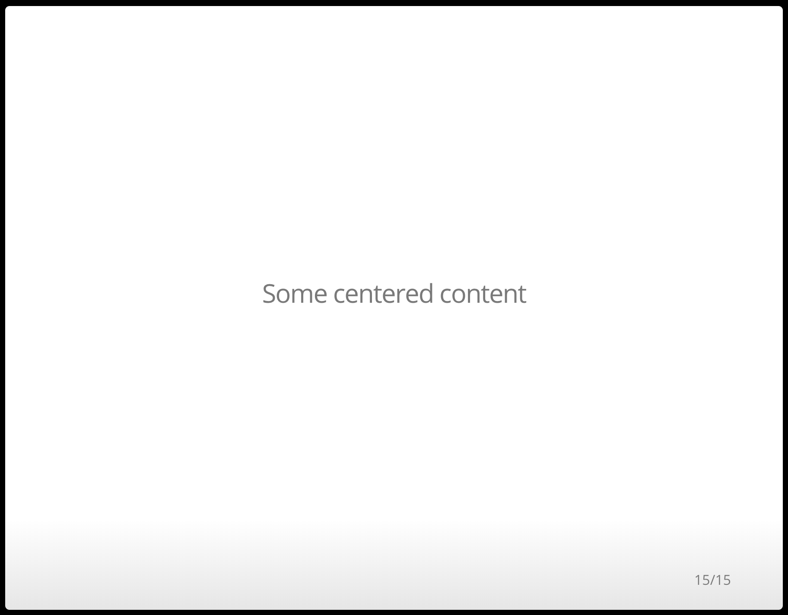
```

<br>

You can horizontally center a certain item on a slide by enclosing it in an HTML `<div>` tag with `class="centered"`. For example

````markdown
## A slide with some centered content

<div class="centered">
This text is centered
</div>

This text is not
````

will create a slide that looks like this:

<br>

```{r ioslides_centered_2, echo = FALSE, out.width = "80%", fig.align = "center"}
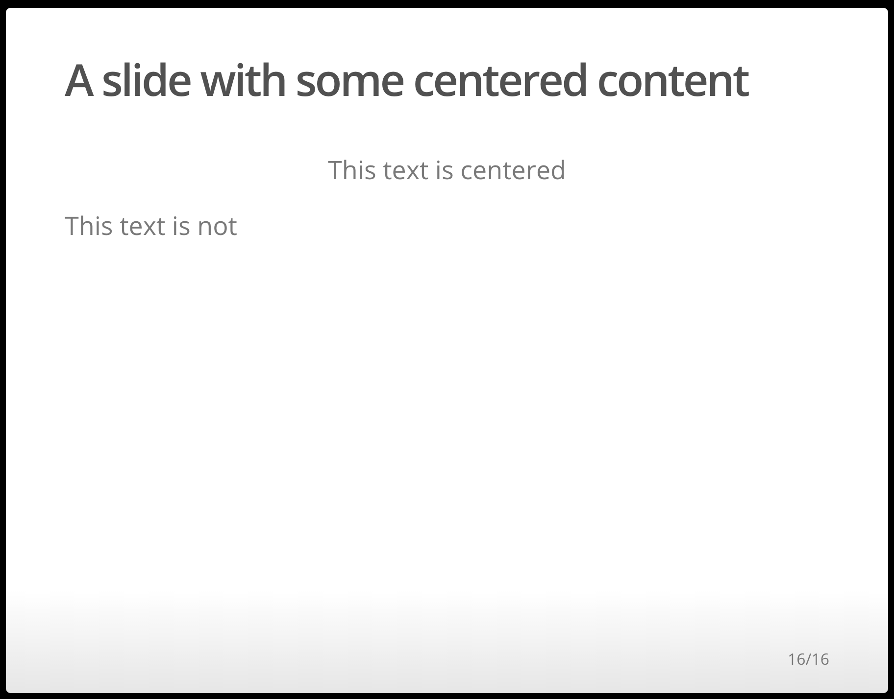
```

<br>

### Two columns

You can create a two-column layout using the HTML `columns-2` class. For example, here is a slide with an image on the left and a bulleted list on the right

````markdown
<div class="columns-2">
  

  * A photo collage
  * of some women in science
  * featured in SAFS News
</div>
````

will create a slide that looks like this:

<br>

```{r ioslides_2columns, echo = FALSE, out.width = "80%", fig.align = "center"}
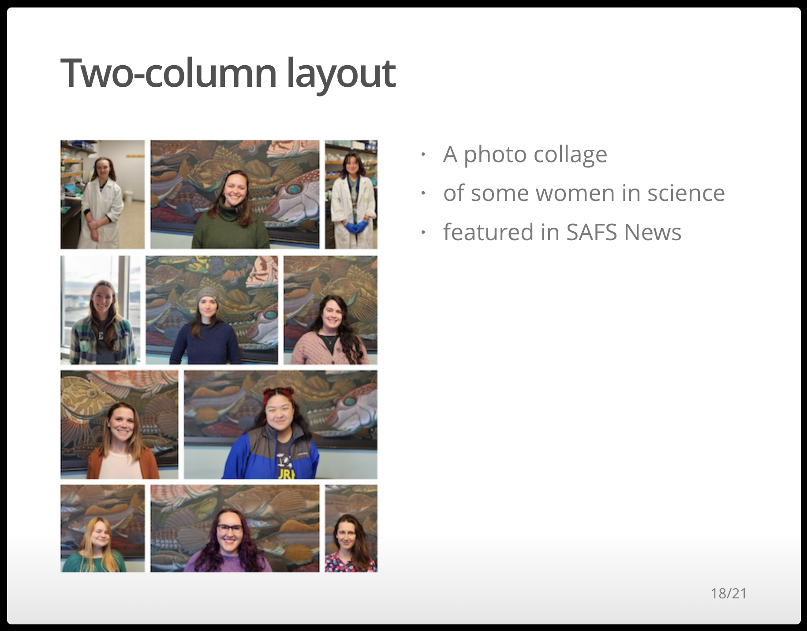
```

<br>


### Text color

You can add colored text with any of the HTML color classes (eg, `red`, `blue`) or variations of them (eg, `red2`, `blue2`). For example, this code

````markdown
## A slide with colored text

<div class="red2">
This text is red
</div>

<div class="blue">
This text is blue
</div>
````

will create a slide that looks like this:

<br>

```{r ioslides_colortext, echo = FALSE, out.width = "80%", fig.align = "center"}
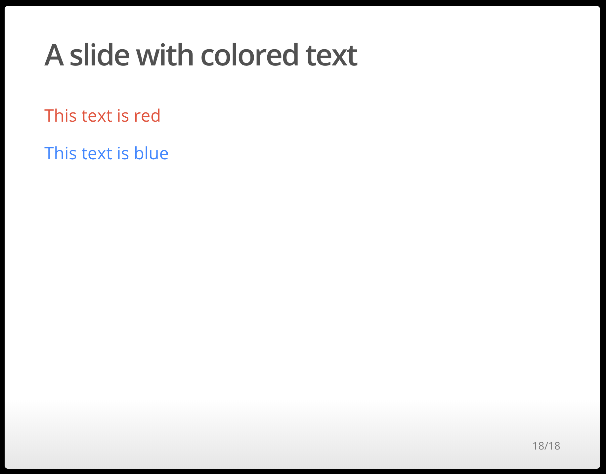
```

<br>

## Custom CSS

For even greater flexibility in formatting, you can write your own CSS in a separate file and include a reference to it in the YAML of your ioslides presentation. For example, if your CSS was written in `custom_styles.css`, then your YAML would include the following

````markdown
---
output:
  ioslides_presentation:
    css: custom_styles.css
---
````

You can also target specific slides or classes of slides with custom CSS by adding IDs or classes to the slides headers within your document. For example, if we defined the following classes in the file `custom_styles.css` and included it in the same folder/directory as our `.Rmd` file:


```
.blue-text {
  color: blue;
}

.emphasized {
  font-size: 1.5em;
}
```

then we could include the following classes in the slide's header

````markdown
## Future Steps {.blue-text .bigger}

This is blue and bigger
````

which would look like this when rendered

<br>

```{r ioslides_css_1, echo = FALSE, out.width = "80%", fig.align = "center"}
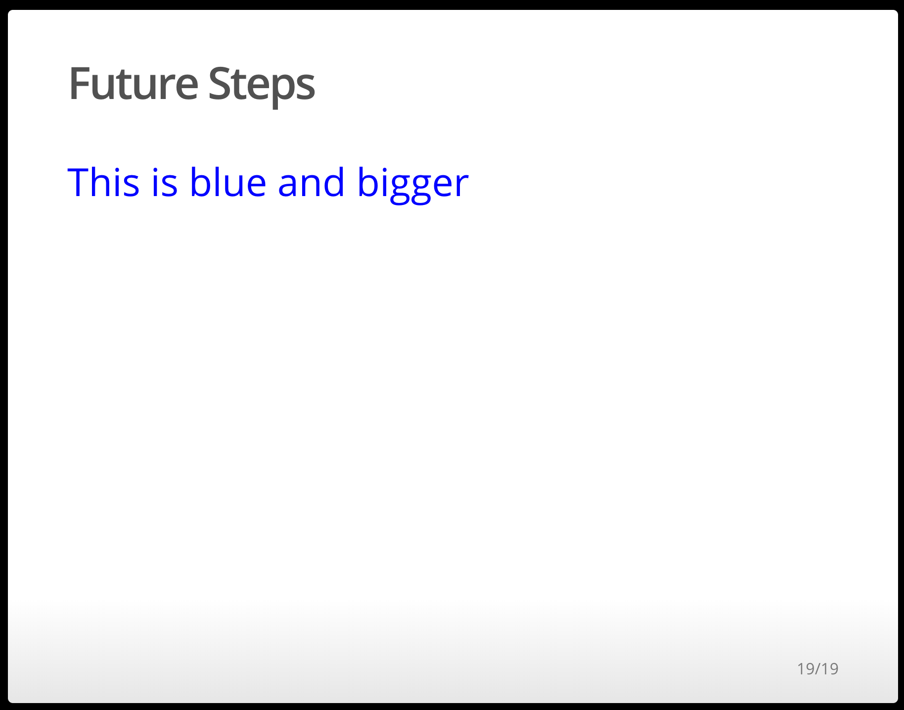
```

<br>

***

## Displaying your presentation

Every time you knit your `.Rmd` file, a corresponding file with an `.html` extension is created. This file can be opened in any web browser. You can use any of the following single character shortcuts to enable alternate display modes:

* `f`: enable fullscreen mode

* `w`: toggle widescreen mode

* `o`: enable overview mode

* `h`: enable code highlight mode

* `p`: show presenter notes

Pressing `esc` exits all of these modes. 

### Presenter mode

You can open a separate presenter window that includes notes for yourself. The window will stay in sync with the main presentation window and also show any optional notes and a thumbnail of the next slide. To enable presenter mode add `?presentme=true` to the URL of the presentation. For example:

````markdown
my-presentation.html?presentme=true
````

The presenter mode window will open and will always re-open with the presentation until it is disabled with:

````markdown
my-presentation.html?presentme=false
````

You can include presenter notes on a slide by enclosing them with the HTML `notes` class within a `div`. For example,

````markdown
## Slide with presenter notes

<div class="notes">
Here are my notes for this slide:

* mention optional notes

* don't forget to exit
</div>

This slide has some notes, but they're hidden from view
````

You can then press `p` in your presentation to open a new window with the presentation and corresponding notes. For example, here's what the presenter's view will look like

<br>

```{r ioslides_presenterview, echo = FALSE, out.width = "80%", fig.align = "center"}
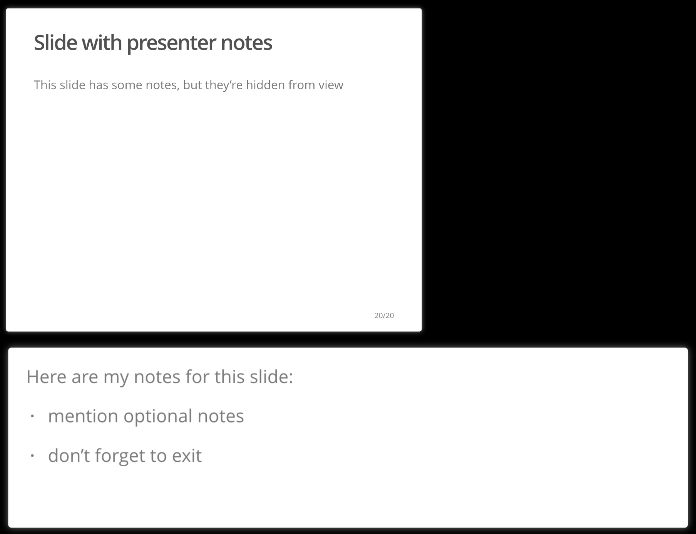
```

<br>


