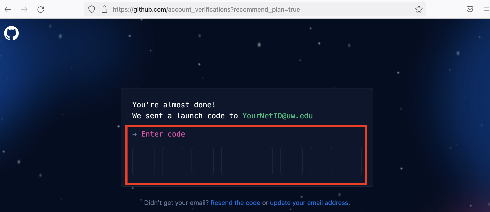

```{r setup, include=FALSE}
knitr::opts_chunk$set(echo = TRUE)
```

<br>

# What is GitHub?

GitHub is a code hosting platform for version control and collaboration. It lets you and others work together on projects from anywhere. GitHub itself is not a development tool, but rather a file hosting and collaboration site. In many ways, a social network like Facebook. You can build a profile, create projects to share with others, and follow the accounts of other users. GitHub is not linked to any one programming language like **R**, as you can find all kinds of projects based upon different languages there.

GitHub also runs **Git** in the background. Git is a version control software, which means it records changes to a file or set of files over time so that you can recall specific versions later. We'll learn more about Git in the next session.

***

# Creating an account

Signing up for a free account on GitHub is easy and straightforward. Begin by navigating to [https://github.com](https://github.com).

<div class="boxy boxy-blue boxy-clipboard-list">
**Task:** Click on the **Sign up** button in the upper right.
</div>


<br>

<div class="boxy boxy-blue boxy-clipboard-list">
**Task:** Enter the email address you'd like to associate with your account.
</div>

<div class="boxy boxy-orange boxy-lightbulb">
**Tip:** You can change your email address or add another one later.
</div>


<br>

<div class="boxy boxy-blue boxy-clipboard-list">
**Task:** Enter a password.
</div>


<br>

<div class="boxy boxy-blue boxy-clipboard-list">
**Task:** Select a username for your account.
</div>

<div class="boxy boxy-orange boxy-lightbulb">
**Tip:** This will form part of the URL where you will access your account (`https://github.com/USERNAME`).
</div>


<br>

<div class="boxy boxy-blue boxy-clipboard-list">
**Task:** Answer a question about electing to receive notices and info from GitHub (you can choose "n").<br>
</div>

<div class="boxy boxy-blue boxy-clipboard-list">
**Task:** Solve a puzzle to confirm you are a human being & GitHub will send you an email with a 6-digit code to enter.
</div>



<br>

<div class="boxy boxy-success boxy-check">
**Success:** You now have a GitHub account and can start using it for data science.
</div>

